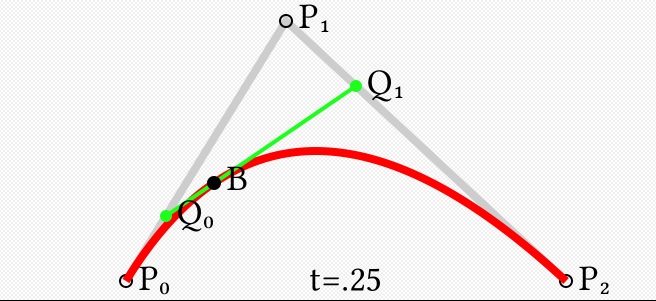
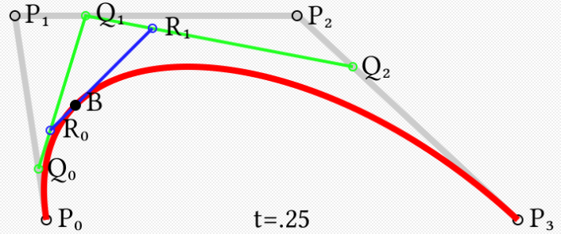

### 贝赛尔曲线

曲线定义：起始点、终止点（也称锚点）、控制点。通过调整控制点，贝塞尔曲线的形状会发生变化。

P0为起点,Pn为终点,Pi为控制点

* 一阶贝塞尔曲线(线段)：

  

  由 P0 至 P1 的连续点， 描述一条线性贝塞尔曲线。

  Q为贝塞尔曲线上一点则 **$t = \frac{P_0Q}{P_0P_1}$**

  整理得函数式：

  $\mathbf{B}(t)=\mathbf{P}_0 + (\mathbf{P}_1-\mathbf{P}_0)t=(1-t)\mathbf{P}_0 + t\mathbf{P}_1 \mbox{ , } t \in [0,1]$

* 二阶贝塞尔曲线：

  

  

  为建构二次贝塞尔曲线，可以中介点**Q**0和**Q**1作为由0至1的*t*：

  - 由**P**0至**P**1的连续点**Q**0，描述一条线性贝塞尔曲线。
  - 由**P**1至**P**2的连续点**Q**1，描述一条线性贝塞尔曲线。
  - 由**Q**0至**Q**1的连续点**B**（*t*），描述一条二次贝塞尔曲线。

  有：$t= \frac{P_0Q_0}{P_0P_1}=\frac{P_1Q_1}{P_1P_2}=\frac{Q_0B}{Q_0Q_1}$

  整理得函数式：

  $\mathbf{B}(t) = (1 - t)^{2}\mathbf{P}_0 + 2t(1 - t)\mathbf{P}_1 + t^{2}\mathbf{P}_2 \mbox{ , } t \in [0,1]$

* 高阶贝塞尔曲线：

  为建构高端曲线，便需要相应更多的中介点。对于三次曲线，可由线性贝塞尔曲线描述的中介点**Q**0、**Q**1、**Q**2，和由二次曲线描述的点**R**0、**R**1所建构：

  

  有：$t= \frac{P_0Q_0}{P_0P_1}=\frac{P_1Q_1}{P_1P_2}=\frac{P_2Q_2}{P_2P_3}=\frac{Q_0R_0}{Q_0Q_1}=\frac{Q_1R_1}{Q_1Q_2}=\frac{R_0R_B}{R_0R_1}$

  整理得函数式：$\mathbf{B}(t)=\mathbf{P}_0(1-t)^3+3\mathbf{P}_1t(1-t)^2+3\mathbf{P}_2t^2(1-t)+\mathbf{P}_3t^3 \mbox{ , } t \in [0,1]$

二阶贝塞尔代码参考:code/5.二阶贝塞尔.cs