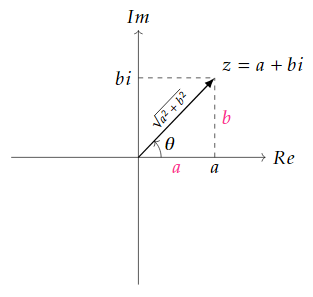
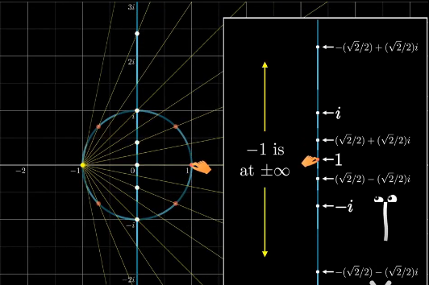
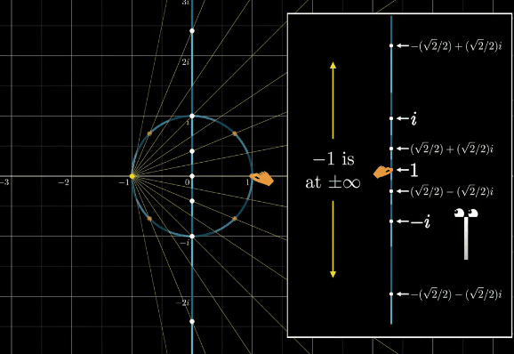
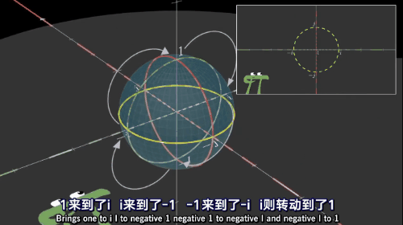

[原文链接1](https://www.bilibili.com/video/av33385105)
[原文链接2](https://krasjet.github.io/quaternion/)

$i^2 = j^2 = k^2 = ijk = -1$

### 用矩阵理解：

复数的相乘其实是**旋转与缩放变换**的复合

#### 如果有两个复数相乘

$𝑧_1=𝑎+𝑏𝑖, 𝑧_2=𝑐+𝑑𝑖$

$z_1z_2 = (a+bi)(c+di)$

​		$=ac + adi +bci + bdi^2$

因为$i^2 = -1$

$z_1z_2 = ac- bd+ adi + bci$

​		 $= ac -bd + (bc + ad)i$

* 可以理解为矩阵对向量的变换：		$\begin{bmatrix} a&-b \\ b&a \end {bmatrix}\begin{bmatrix} c \\ d \end {bmatrix} = \begin{bmatrix} ac-bd \\ bc+ad \end {bmatrix}$

* 也可以理解为矩阵的相乘(且满足交换律)： $z_1z_2 = \begin{bmatrix} a&-b \\ b&a \end {bmatrix}\begin{bmatrix} c&-d \\ d&c \end {bmatrix} = \begin{bmatrix} ac - bd&-(ad+bc) \\ bc+ad&ac-bd \end {bmatrix}$

  $z_1z_2 = \begin{bmatrix} c&-d \\ d&c \end {bmatrix} \begin{bmatrix} a&-b \\ b&a \end {bmatrix}= \begin{bmatrix} ac - bd&-(ad+bc) \\ bc+ad&ac-bd \end {bmatrix}$

$\begin{bmatrix} a&-b \\ b&a \end {bmatrix}= \sqrt{a^2 + b^2} \begin{bmatrix} \frac{a}{\sqrt{a^2 + b^2}}&\frac{-b}{\sqrt{a^2 + b^2}} \\ \frac{b}{\sqrt{a^2 + b^2}}&\frac{a}{\sqrt{a^2 + b^2}} \end {bmatrix}$

结合下图：

$\left \| z \right \|$为复数的模长则：

$\begin{bmatrix} a&-b \\ b&a \end {bmatrix}= \sqrt{a^2 + b^2} \begin{bmatrix} \cos(\theta)&-\sin(\theta) \\ \sin(\theta)&\cos(\theta) \end {bmatrix}$

​						  $= \begin{bmatrix} \left \| z \right \|&0 \\0&\left \| z \right \| \end {bmatrix}\begin{bmatrix} \cos(\theta)&-\sin(\theta) \\ \sin(\theta)&\cos(\theta) \end {bmatrix}$

即这个变换是先逆时针旋转了$\theta$，再缩放复数的模长$\left \| z \right \|$

#### 二维旋转的复合

 如果我们需要对一个向量$v = x+yi$仅进行旋转操作。

* 我们可以使用模长为1的复数 $z_1= \cos(\theta) + i\sin(\theta)$

  $v' = z_1v$

* 在此基础上，在进行$z_2= \cos(\phi) + i\sin(\phi)$的旋转

  $v''= z_2(z_1v)$

  ​	$= (z_2z_1)v$

* 如果将这两次旋转做出的等效变换称之为$z_{net}$， 则：

  $v'' = (z_2z_1)v = z_{net}v$

  $z_{net} =  \cos(\phi) + i\sin(\phi)(\cos(\theta) + i\sin(\theta))$

  ​	 $= \cos(\phi)\cos(\theta) - \sin(\phi)\sin(\theta) + (\cos(\phi)\sin(\theta) + \sin(\phi)\cos(\theta))i$

  ​	$= \cos(\theta + \phi) + i(\sin(\theta + \phi))$

所以两次旋转的复合，得到的变换仍是旋转，**与施加的次序无关**，且等效变换的**旋转角是$z_1$与$z_2$的旋转角之和**

#### 三维空间中的旋转

旋转的分解

如图：

如果向量$v$沿着向量$u$(定义为单位向量)旋转一个角度，可以将其分解成$v_{\parallel}$ 和 $v_{\perp}$两个分量的旋转。

$v_{\parallel}$旋转后还是$v_{\parallel}$，所以不用管。

##### $v_{\perp}$的旋转

先计算$v_{\perp}$

* $v_{\perp}$， $v_{\perp} = v - v_{\parallel}$

   					$=v - \left | v \right | \cdot \cos(\theta)u$

  ​					$=v - \left | v \right | \frac{u \cdot v}{ \left | u \right | \left | v \right |} u$

  ​					$= v - (u \cdot v )u$

  * $\theta$为$v_{\parallel}$与$v$的夹角

#### 一维到二维的理解

二维空间的单位圆映射到一维空间，

然后对二维空间的单位圆上的坐标点$w$ 应用(旋转或缩放)变换$z$，即用 $z \cdot w$ 

如果$z$ 等于$i$

如果$w$为$(\sqrt2/2)+(\sqrt2/2)i$

则 $z \cdot w = i \cdot ((\sqrt2/2)+(\sqrt2/2)i) = -(\sqrt2/2) + (\sqrt2/2)i$ 

当然，可以理解为这个变换是对整个二维空间而不是一个点$(\sqrt2/2)+(\sqrt2/2)i$或一个单位圆。

所以当我们处于一维空间时就可以使用 实部+虚部 对二维空间进行变换，但是一维的我们理解下来只是对投影的值进行了变换

#### 二维到三维的理解

