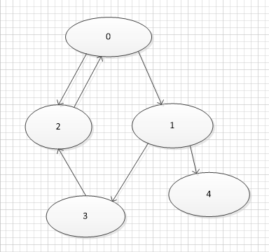

### 1.有向图 十字链表

如图：




如果想要储存上述图结构可以使用**邻接表**方式：  

> 下面数字表示一个节点，“->”表示链表的指向
>
> ```
> 0->2->1
> 1->3->4
> 2->0
> 3->2
> 4
> ```
>
> 每一个数字是一个节点，0指向1且指向2.

如果我想知道谁指向2，可能要遍历0-4指向的所有节点，这时可以使用**逆邻接表**:

>```
>0->2
>1->0
>2->3->0
>3->1
>4->1
>```
>
>这里我们可以很容易找到有0,3指向2

如果我们既要节点2指向谁，又想很方便的查到谁指向2可以使用**十字链表**:   

>```
>      2<-0->2->1
>      0<-1->3->4
> 3<-0<-2->0
>      1<-3->2
>      1<-4
>```
>
>这里我们新建了17个节点

5个主节点，指向节点有12个，如果我们存储边而不是存储节点，这样只要储存5个节点，12/2=6条边,**优化后**

>	     ```
>	     	     2-0<-0->0-1->0-2
>	     	     0-1<-1->1-3->1-4
>	     	3-2<-0-2<-2->2-0
>	     	     1-3<-3->3-2
>	     	     1-4<-4
>```
>
>看起来是12条边，但是左半部分和右半部分的边是同一个实例。所以还是6个

代码见code文件夹：  

python代码见python->工具->3.创建十字链表(有向图)

