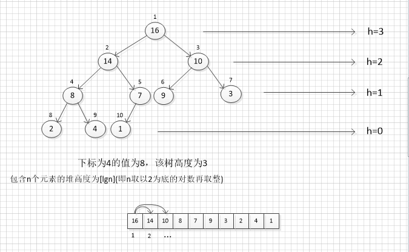
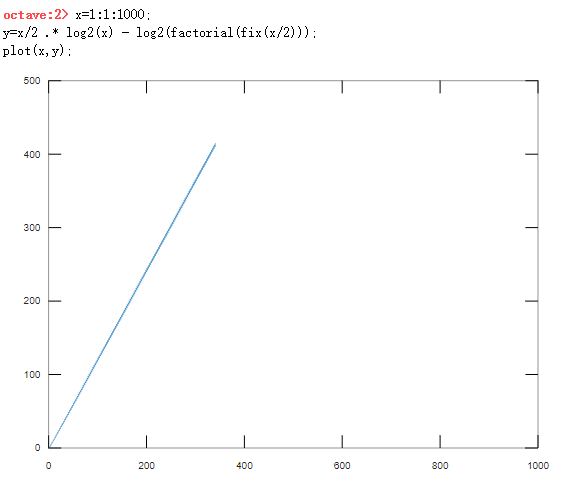

#### 堆



上图中树的高度为3，下标为4(值为8)的节点高度为1。

如上图，(二叉)堆是一个用数组结构存储，因为除最底层外，该树是充满的。而且是从左到右填充。所以是一个完全二叉树，

一个完全二叉树的树高h=lg(n)，$n$是结点个数

表示堆的数组A有两个属性：

* **A.length**:(通常)给出数组元素个数

* **A.heap-size**:表示有多少个堆元素存储在该数组中。

即，虽然A[1..A.length]可能存有数据，但只有A[1..A.heap-size]中存放的是堆的有效元素，这里，0≤A.heap-size≤A.length。树的根节点是A[1]，这样给定的一个结点下标i，我们很容易得到他的

1. 父节点 PARENT(i):i/2

2. 左孩子 LEFT(i):2i

3. 右孩子 RIGHT(i):2i+1

二叉堆可以分为两种形式：最大堆和最小堆。

最大堆性质：除了根结点外所有结点i都要满足A[PARENT(i)]≥A[i]

最小堆性质：除了根结点外所有结点i都要满足A[PARENT(i)]≤A[i]

##### 堆排序的基本过程：

* MAX-HEAPIFY过程：其时间复杂度为O(lgn),它是维护最大堆性质的关键
* BUILD-MAX-HEAP过程：具有线性时间复杂度，功能是从无序的输入数据数组中构造一个最大堆。
* HEAPSPORT过程：其时间复杂度为O(nlgn),功能是对一个数组进行原值排序。
* MAX-HEAP-INSERT、HEAP-EXTRACT-MAX、HEAP-INCREASE-KEY和HEAP-MAXIMUM过程：时间复杂度为O(lgn),功能是利用堆实现一个优先队列。

##### MAX-HEAPIFY：

```
public void MAX_HEAPIFY(int i)
{
    int largest;
    var l = LEFT(i);
    var r = RIGHT(i);
    if (l < HeapSize && compare(A[l], A[i]) > 0)
        largest = l;
    else
        largest = i;

    if (r < HeapSize && compare(A[r], A[largest]) > 0)
        largest = r;

    if (largest != i)
    {
        Exchange(i, largest);
        MAX_HEAPIFY(largest);
    }
}
public void Exchange(int i, int j)
{
    T temp = A[i];
    A[i] = A[j];
    A[j] = temp;
}
public int LEFT(int i)
{
    return (i << 1) + 1;
}

public int RIGHT(int i)
{
    return (i << 1) + 2;
}
```

上述代码，会将i节点和其左右孩子比较，并与其中**最大的**交换，交换后有可能破坏以孩子结点为根的子树最大堆性质，所以要递归调用直至h=0。

##### BUILD-MAX-HEAP

我们可以用自底向上的方法利用过程MAX-HEAPIFY把一个大小为n=A.length的数组转换为最大堆。

因为A的最后一个结点的PARENT结点是最后一个根节点，以后都是叶节点。所以我们可以从索引 PARENT(HeapSize-1) -> 0 执行MAX-HEAPIFY

    public void BUILD_MAX_HEAP()
    {
        for (int i = PARENT(HeapSize - 1); i >= 0; i--)
        {
            MAX_HEAPIFY(i);
        }
    }
复杂度：
$$
\sum_{i=1}^{n/2}（\log_2 n -\log_2 i）= \frac{n}{2}\log_2 n -\log_2 \frac{n}{2}!
$$
高度为h($\log_2 n -\log_2 i$)的结点执行MAX_HEAPIFY复杂度是$O(h)$



是线性的。

##### HEAPSORT

    public void HEAPSORT()
    {
        BUILD_MAX_HEAP();
        int heapSize = HeapSize;
        for (int i = HeapSize-1; i >=1; i--)
        {
            Exchange(0,i);//最大的换到最后
            HeapSize = HeapSize - 1;
            MAX_HEAPIFY(0);//维护剩余的值最大堆性质
        }
        HeapSize = heapSize;
    }
    //用法
    int[] E = new int[] { 4, 3, 8, 45, 23, 3, 57, 1 };
    Heap<int> test = new Heap<int>(E,(a,b)=>a-b);
    test.HEAPSORT();
升序排序

建好最大堆后，将A[0]\(最大值)与最后一个值交换，然后对A[0]执行MAX_HEAPIFY维护剩下值的最大堆性质。这样依次取剩余的最大值即可完成排序。

复杂度$O(nlgn)$。

##### 优先队列

一个最大优先队列支持以下操作：

* INSERT(S,x):把元素x插入集合S中。这一操作等价于$S=S\bigcup {x}$
* MAXIMUM(S):返回S中具有最大键字的元素
* EXTRACT-MAX(s):去掉并返回S中的具有最大键字的元素。
* INCREASE-KEY(S,x,k):将元素x的关键字值增加到k，这里假设k的值不小于x的原关键字值。

##### MAXIMUM

```
public T MAXIMUM()
{
    return A[0];
}
```

满足最大堆性质的堆最大值为第一个元素A[0]

##### EXTRACT-MAX

    public T EXTRACT_MAX()
    {
        if (HeapSize < 1)
            throw new Exception("heap underflow");
        T max = A[0];
        A[0] = A[HeapSize - 1];
        HeapSize--;
        MAX_HEAPIFY(0);
        return max;
    }
最大值为A[0],赋值给max后，将A[0]赋值为二叉堆最后一个元素，然后移除最后一个元素。因为` A[0] = A[A.Count - 1];`导致最大堆性质改变，所以要执行`MAX_HEAPIFY(A,0,A.Count);`以维护最大堆性质。

##### INCREASE-KEY

    public void INCREASE_KEY(int i, T key)
    {
        if (compare(A[i], key) > 0)
        {
            A[i] = key;
            MAX_HEAPIFY(i);
        }
        else
        {
            while (i > 0 && compare(key, A[PARENT(i)]) > 0)
            {
                A[i] = A[PARENT(i)];
                i = PARENT(i);
            }
            A[i] = key;
        }
    }

将一个键值增大时会影响最大堆性质，因为是值变大，所以循环上浮即可。

