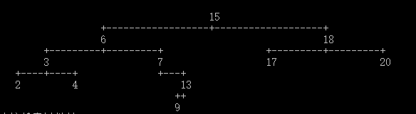
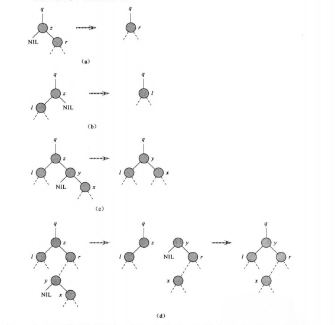

## 二叉搜索树

接[5.堆排序](5.堆排序)
堆排序所涉及的到的二叉树都是完全二叉树，使用的存储结构是数组。当结构是不完全二叉树时，使用数组会极大浪费空间，这时候就要使用链表数据结构来表示。每个节点就是一个对象，除了key之外，每个节点还包含属性left，right和p，他们分别指向节点的左孩子，右孩子和双亲。如果某个孩子节点和父节点不存在，则相应的属性的值为NIL。根节点是树中唯一父指针为NIL的结点。



结点数据结构：

```
public class Node<T>
{
    public T value;
    public Node<T> left;
    public Node<T> right;
    public Node<T> parent;
}
```

##### 性质：

**设$x$是二叉搜索树中的一个结点。如果$y$是$x$左子树中的一个结点，那么$y.key\leq x.key$。如果$y$是$x$右子树中的一个结点，那么$y.key\geq x.key$。**


##### INORDER_TREE_WALK1

二叉搜索树性质允许我们通过一个简单的递归算法来**按序**输出二叉搜索树中的所有关键字，这种算法称为**中序遍历**。

    //中序遍历(递归)
    public void INORDER_TREE_WALK1(Node<T> x)
    {
        if (x != null)
        {
            INORDER_TREE_WALK1(x.left);
            Print(x.value);
            INORDER_TREE_WALK1(x.right);
        }
    }
另一种实现(不使用递归)

    //中序遍历2(栈)  原则上 首先循环压入左侧，然后每次压入新右侧都循环压入左侧
    public void INORDER_TREE_WALK2(Node<T> x)
    {
        Stack<Node<T>> stack = new Stack<Node<T>>();
        bool done =false;
    
        while (!done)
        {
            if (x != null)
            {
                stack.Push(x);
                x = x.left;
            }
            else
            {
                if (stack.Count > 0)
                {
                    x = stack.Pop();
                    Print(x.value);
                    x = x.right;
                }
                else
                    done = true;
            }
        }
    }
输出：


可以看到是有序的。

##### TREE_SEARCH (查询)

递归写法：

    public Node<T> TREE_SEARCH(Node<T> node,T k)
    {
        if (node == null || compare(k,node.value) == 0)
        {
            return node;
        }
        if (compare(k,node.value) < 0)
        {
            return TREE_SEARCH(node.left,k);
        }
        return TREE_SEARCH(node.right, k);
    }
非递归写法

    public Node<T> ITERACTIVE_TREE_SEARCH(Node<T> node, T k)
    {
        while (node !=null && compare(k,node.value)!=0)
        {
            if (compare(k, node.value) < 0)
            {
                node = node.left;
            }
            else
            {
                node = node.right;
            }
        }
        return node;
    }
运行时间$O(h)​$，h是这棵树的高度


##### TREE_MINIMUM(最小值)

    //最小值
    public Node<T> TREE_MINIMUM(Node<T> node)
    {
        while (node.left != null)
        {
            node = node.left;
        }
        return node;
    }
##### TREE_MAXIMUM(最大值)

    //最大值
    private Node<T> TREE_MAXIMUM(Node<T> x)
    {
        while (x.right != null)
        {
            x = x.right;
        }
        return x;
    }
##### TREE_SUCCESSOR(后继)

    //中序遍历 的某结点后继
    public Node<T> TREE_SUCCESSOR(Node<T> x)
    {
        if (x.right != null)
            return TREE_MINIMUM(x.right);
    
        var y = x.parent;
        while (y !=null &&x == y.right)
        {
            x = y;
            y = y.parent;
        }
        return y;
    } 
##### TREE_PREDECESSOR(前驱)

    //中序遍历 的某结点前驱
    public Node<T> TREE_PREDECESSOR(Node<T> x)
    {
        if (x.left != null)
            return TREE_MAXIMUM(x.left);
    
        var y = x.parent;
        while (y !=null && x == y.left)
        {
            x = y;
            y = y.parent;
        }
        return y;
    } 
##### TREE_INSERT(插入)

    //插入
    public void TREE_INSERT(Node<T> x)
    {
        if (head == null)
        {
            head = x;
            return;
        }
    
        var node = head;
        var y = node;
        while (node != null)
        {
            y = node;
            if (compare(x.value, node.value) < 0)
            {
                node = node.left;
            }
            else
            {
                node = node.right;
            }
        }
        if (compare(x.value, y.value) < 0)
            y.left = x;
        else
            y.right = x;
    
        x.parent = y;
    }
##### TREE_DELETE(删除)

    public void TREE_DELETE(Node<T> z)
    {
        
        if (z.left == null)
            TRANSPLANT(z,z.right);
        else if (z.right == null)
            TRANSPLANT(z, z.left);
        //有两孩子
        else
        {
            var y = TREE_MINIMUM(z.right);
            if (y.parent != z)
            {
                TRANSPLANT(y, y.right);
    
                y.right = z.right;
                y.right.parent = y;
    
            }
            TRANSPLANT(z, y);
            y.left = z.left;
            y.left.parent = y;
        }
    }
    
    // 嫁接(删除节点中需要的一个操作)
    public void TRANSPLANT(Node<T> u,Node<T> v)
    {
        if (u == head)
            head = v;
        else if (u == u.parent.left)
            u.parent.left = v;
        else if (u == u.parent.right)
            u.parent.right = v;
        if (v != null)
            v.parent = u.parent;
    }
上述几个操作中只有删除操作较为复杂，比如要删除节点$z​$，可以分为以下几种情况。

1. $z​$没有孩子结点,那么可以直接删除，将其父节点对应的孩子结点赋$Nil​$

2. $z$只有一个孩子，直接将孩子提升至树中$z​$的位置，修改对应的指针，下图中的(a)(b)情况

3. $z$有两个孩子，**为了保持二叉搜索树的性质**。这时候有两种方法处理

   ​    (1)  找到$z$的后继$y$，让$y$占据树中$z$的位置，$z$原来右子树的部分成为$y$的新的右子树，$z$的左子树成为$y$新的左子树，下图中的(c)(d)情况

   ​    (2) 找到$z$的前驱$y$，让$y$占据树中$z$的位置，$z$原来右子树的部分成为$y$的新的右子树，$z$的左子树成为$y$新的左子树

   上面两种方法都要考虑$y$的位置和孩子情况，以(1)为例，1.如果$y$是$z$的右孩子，则$y$肯定没有左孩子(因为$y$是$z$的后继，所以如果$y$有左孩子，$y$就不可能是$z$的后继)，这时可以直接用$y$嫁接到$z$的位置。2.如果$y$ 不是$z$的右孩子($y$ 同样没有左孩子)，将$y$的右子树替换$y$的位置，再将$y$替换到$z$的位置即可，如下图(c)(d)



代码参考code/二叉搜索树.cs