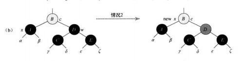
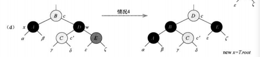

## 红黑树

​	一棵红黑树是满足下面**红黑性质**的二叉搜索树。它在每个结点上增加了一个存储位来表示结点的**颜色**，可以是**RED**或**BLACK**。通过对任何一条从根到叶子的简单路径上各个结点的颜色进行约束，红黑树确保没有一条路径会比其他路径长出2倍，因而是近似于**平衡的**。

#### 性质

1. 每个结点或是红色的，或是黑色的。
2. 根节点是黑色的
3. 每个叶节点($NIL$)是黑色的。
4. 如果一个结点是红色的，则它的两个子结点都是黑色的。
5. 对每个结点，从该结点到其所有后代叶节点的简单路径上，均包含相同数目的黑色结点。

从某个结点$x$出发(不含该结点)到达一个叶结点的任意一条简单路径上的黑色结点($Nil$也视为黑色结点)个数称为该结点的**黑高(black-height)**，记为$bh(x)$。根据性质5，每个结点的黑高是一个确定值。定义红黑树的黑高为其根结点的黑高。

如有以下红黑树，则其黑高 bh = 2,N为一个颜色为黑的结点代表空结点， 

```
		  N
          |
          ❶               
        /    \
       ②       ❸		   
     /   \    /  \
    ❹     ❺  N    N		   
  /  \  /  \
 N   N N    N 

bh(❶) = bh(②) = 2
bh(❸)=bh(❹)=bh(❺)=1
```

内部结点：不包括$Nil$的结点

> **引理：一棵有n个内部结点的红黑树的高度至多为2lg(n+1)。**

证明：假如一个树黑高为$h_b$，则其最少包含$2^{h_b} -1$个内部结点，因为黑高为$h_b$意味着根节点到叶结点(简单路径)经过的黑色结点为$h_b$个。则这个二叉堆在高度为0-$h_b$的范围内是满结点的，所以结点最少包含$2^{h_b} -1$

因为$n \geq 2^{h_b}-1$  ,   $ h \leq 2{h_b}$ (性质4)

 所以$h \leq 2lg(n+1)$

#### 旋转

​	搜索树操作`TREE-INSERT`和`TREE-DELETE`在含$n$个关键字的红黑树上，运行花费时间为O(lgn)。由于这两个操作对树做了修改，结果可能违反之前列出的红黑树性质。为了维护这些性质，必须要改变树中某些结点的颜色以及指针结构。

指针结构的修改是通过**旋转(ratation)**来完成的，这是一种能保持二叉搜索树性质的搜索树局部操作。


旋转后不会破坏二叉搜索树的性质但是有可能破坏红黑树的性质。所以还需要其他操作。

旋转操作代码如下：执行旋转操作时默认x，y都不为空。 

```c#
//左旋和右旋都默认 x，y结点不为Nil
public void LEFT_ROTATE(Node<T> x)
{
    var y = x.right;
    x.right = y.left;
    if (y.left != Nil)
        y.left.parent = x;
    y.parent = x.parent;
    if (x.parent == Nil)
        head = y;
    else if (x == x.parent.left)
        x.parent.left = y;
    else
        x.parent.right = y;

    y.left = x;
    x.parent = y;
}

public void RIGHT_ROTATE(Node<T> y)
{
    var x = y.left;
    y.left = x.right;
    if (x.right != Nil)
        x.right.parent = y;
    x.parent = y.parent;
    if (y.parent == Nil)
        head = x;
    else if (y == y.parent.left)
        y.parent.left = x;
    else
        y.parent.right = x;
    x.right = y;
    y.parent = x;
}
```
##### RB-INSERT(插入结点)

我们可以在O(lgn)时间内完成向一棵含n个结点的红黑树中插入一个新节点。逻辑和二叉搜索树的TREE_INSERT差不多，但是为了保证红黑性质能够继续保持，我们调用一个辅助程序**RB-INSERT-FIXUP**来对结点重新着色并旋转

```c#
public void RB_INSERT(Node<T> z)
{
    var y = Nil;
    var x = head;
    while (x != Nil)
    {
        y = x;
        if (compare(z.value, x.value) < 0)
            x = x.left;
        else
            x = x.right;
    }
    z.p = y;
    if (y == Nil)
    {
        head = z;
    }
    else if(compare(z.value,y.value) < 0)
    {
        y.left = z;
    }
    else
    {
        y.right = z;
    }
    z.left = Nil;
    z.right = Nil;
    z.color = RED;
    BR_INSERT_FIXUP(z);
}

public void BR_INSERT_FIXUP(Node<T> z)
{
    while (z.p.color == RED)
    {
        if (z.p == z.p.p.left)
        {
            var y = z.p.p.right;
            if (y.color == RED)
            {
                z.p.color = BLACK;
                y.color = BLACK;
                z.p.p.color = RED;
                z = z.p.p;
            }
            else

            {
                if (z == z.p.right)
                {
                    z = z.p;
                    LEFT_ROTATE(z);


                }

                z.p.color = BLACK;
                z.p.p.color = RED;
                RIGHT_ROTATE(z.p.p);
            }
        }
        else if (z.p == z.p.p.right)
        {
            var y = z.p.p.left;
            if (y.color == RED)
            {
                z.p.color = BLACK;
                y.color = BLACK;
                z.p.p.color = RED;
                z = z.p.p;
            }
            else
            {
                if (z == z.p.left)
                {
                    z = z.p;
                    RIGHT_ROTATE(z);
                }

                z.p.color = BLACK;
                z.p.p.color = RED;
                LEFT_ROTATE(z.p.p);
            }
        }
    }
    head.color = BLACK;
}
//左旋和右旋都默认 x，y结点不为Nil
public void LEFT_ROTATE(Node<T> x)
{
    var y = x.right;
    x.right = y.left;
    if (y.left != Nil)
        y.left.p = x;
    y.p = x.p;
    if (x.p == Nil)
        head = y;
    else if (x == x.p.left)
        x.p.left = y;
    else
        x.p.right = y;

    y.left = x;
    x.p = y;
}

public void RIGHT_ROTATE(Node<T> y)
{
    var x = y.left;
    y.left = x.right;
    if (x.right != Nil)
        x.right.p = y;
    x.p = y.p;
    if (y.p == Nil)
        head = x;
    else if (y == y.p.left)
        y.p.left = x;
    else
        y.p.right = x;
    x.right = y;
    y.p = x;
}
```
在调用`RB_INSERT`插入一个结点$z$后,有可能会破坏红黑树的性质。

我们将插入的结点$z$置红色，所以135性质得以保证，则有可能破坏其他性质的情况为

* 插入后$z$为根节点，破坏性质2
* 插入后$z$的父节点为红色，破坏性质4

如果破坏性质4，如下图

  


插入后如果破坏性质4：

1. $z$父节点一定是红色且不是根节点。(因为性质2根节点不能为红)
2. 如果$z$的叔结点为红色跳转至3，如果$z$的叔结点为黑色跳转至5。
3. 将$z$的父节点，叔结点改为黑色，$z$的祖父结点改为红色，z = z的祖父结点，
4. 这时，如果破坏性质2，即z是根节点，则z结点直接置黑结束。(根节点由红变黑不会破坏红黑性质) ，如果破坏性质4，则跳转到1。
5. 此时$z$的父节点为红色，$z$的祖父结点不为$Nil$且一定为黑色(性质4)，
6.  假设$z$在$z$的祖父结点左侧，如果$z$是右孩子，如上图情况2，左旋$z.parent$(各个结点的黑高不变)，然后右旋$z$的祖父，如上图情况3，随后调整颜色
7. $z$在$z$的祖父结点右侧同理

##### RB-DELETE(删除)

红黑树的删除有些复杂，我们一步步来。删除操作一般会影响性质5，所以我们针对这种情况分析

参考二叉搜索树的删除，我们需要找到实际删除的节点


如果我们要删除z，

1.y替换z，颜色设为z的颜色  红黑性质不变

2.x嫁接到y位置，红黑性质可能改变。

**所以我们实际删除的是y结点**。y结点的颜色影响红黑性质的改变。

对于其他删除的情况，我们要找到实际删除的节点y，和嫁接到y位置的x。例如这种情况

以及(这时y=z，x=l)

**对于我们实际删除的y节点**

* y是红色，删除后不会影响性质5，其他性质也不变，完美解决。

* y是黑色，为了维持性质5，x承担了+1黑的责任。**x节点有这样的属性**：凡是经过x节点到x后代叶节点的简单路径上，包含黑色结点比不经过x节点的数量少一个。

y节点为红色不需要任何操作，红黑树性质不变，所以我们不多赘述。下面讨论y节点为黑色的情况：

<span style="color:red">所以下面我们的思路是释放x承担的+1黑的责任(情况4，情况5)，且不破坏红黑树其他性质</span>，

对于嫁接到y节点的x，如果x是黑色，总是能找到下面的情况对应

定义x的兄弟节点为w

* 情况1：<span style="color:green">x节点为黑色，w节点为红色</span>，这时x的兄弟节点的的孩子一定都是黑色(红黑树性质),操作：左旋x.p,并重新涂色。w会变黑从而变成其他情况。

  

* 情况2：<span style="color:green">x节点为黑色，w节点为黑色，而且w节点的两个孩子都为黑色。</span>这时，将w节点涂红，x的父节点变为x。这个操作依然保持了**x节点的属性**，而且不会影响其他性质。这时新的x如果为红色，则我们达到了目的，如果不是，则重新判断x的情况

  

* 情况3：<span style="color:green">x节点为黑色，w为黑色，w的右孩子为黑色，左孩子为红色</span>。右旋w，并且重新涂色。这时w的右孩子一定为红色，确定转化为情况4。

  

* 情况4:<span style="color:green">x节点为黑色，w为黑色，w的右孩子为红色。</span>这时不用管w的左孩子颜色，直接左旋x.p，并重新涂色。

  

* 情况5：<span style="color:green">x节点为红色且x不为叶节点(Nil)</span>，直接将x涂黑即可释放x需要+1黑色节点的责任。

对于情况1，总是转变成情况2,3,4

对于情况2，总是转变成情况1,,2,3,4,5。每次执行情况2，x的节点高度就加一，如果经过情况2的操作x高度上升为根节点，那么也可以继续保持红黑树的性质5。

对于情况3，执行操作后变为情况4

对于情况4，执行后释放x承担的+1黑的责任，维护了红黑树的性质5

对于情况5，执行后释放x承担的+1黑的责任，维护了红黑树的性质5


```
    // 红黑树 嫁接(删除节点中需要的一个操作)
    public void RB_TRANSPLANT(Node<T> u,Node<T> v)
    {
        if (u.p == Nil)
            head = v;
        else if (u == u.p.left)
            u.p.left = v;
        else if (u == u.p.right)
            u.p.right = v;
        
        v.p = u.p;
    }
    //红黑树 删除结点
    public void RB_DELETE(Node<T> z)
    {
        var y = z;
        Node<T> x;
        var y_original_color = y.color;
        if (z.left == Nil)
        {
            x = z.right;
            RB_TRANSPLANT(z,z.right);
        }
        else if (z.right == Nil)
        {
            x = z.left;
            RB_TRANSPLANT(z, z.left);
        }
        //有两孩子
        else
        {
            y = TREE_MINIMUM(z.right);
            y_original_color = y.color;
            x = y.right;
            if (y.p == z)
            {
                x.p = y;
            }
            else
            {
                RB_TRANSPLANT(y,y.right);
                y.right = z.right;
                y.right.p = y;
            }
            RB_TRANSPLANT(z,y);
            y.left = z.left;
            y.left.p = y;
            y.color = z.color;
        }
        if(y_original_color == BLACK)
            RB_DELETE_FIXUP(x);
    }
    //红黑树 结点删除后fixup
    private void RB_DELETE_FIXUP(Node<T> x)
    {
        while (x != head  && x.color == BLACK)
        {
            if (x == x.p.left)
            {
                var w = x.p.right;
                if (w.color == RED)                                     //case 1
                {
                    w.color = BLACK;
                    x.p.color = RED;
                    LEFT_ROTATE(x.p);
                    w = x.p.right;
                }
                if (w.left.color == BLACK && w.right.color == BLACK)    //case 2
                {
                    w.color = RED;
                    x = x.p;
                }
                else
                {
                    if (w.right.color == BLACK)                         //case 3
                    {
                        w.left.color = BLACK;
                        w.color = RED;
                        RIGHT_ROTATE(w);
                        w = x.p.right;
                    }
                    w.color = x.p.color;                                    //case 4
                    x.p.color = BLACK;
                    w.right.color = BLACK;
                    LEFT_ROTATE(x.p);
                    x = head;
                }

            }
            else if(x== x.p.right)
            {
                var w = x.p.left;
                if (w.color == RED)
                {
                    w.color = BLACK;
                    x.p.color = RED;
                    RIGHT_ROTATE(x.p);
                    w = x.p.left;
                }
                if (w.right.color == BLACK && w.left.color == BLACK)
                {
                    w.color = RED;
                    x = x.p;
                }
                else
                {
                    if (w.left.color == BLACK)
                    {
                        w.right.color = BLACK;
                        w.color = RED;
                        LEFT_ROTATE(w);
                        w = x.p.left;
                    }
                    w.color = x.p.color;
                    x.p.color = BLACK;
                    w.left.color = BLACK;
                    RIGHT_ROTATE(x.p);
                    x = head;
                }

            }
        }
        x.color = BLACK;
    }
```

代码在code/4.红黑树.cs