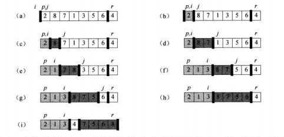

###### 快速排序

快速排序的使用了分治思想。

**分解**：数组$A[p..r]$被划分成两个(可能为空)子数组$A[p..q-1]$和$A[q+1..r]$,使得$A[p..q-1]$中的每一个元素都小于等于$A[q]$，而$A[q]$也小于等于$A[q+1..r]$中的每个元素。其中，计算下标$q$也是划分过程的一部分。

**解决**：通过递归调用快速排序，对子数组$A[p..q-1]$和$A[q+1..r]$进行排序。

**合并**：因为子数组都是原址排序的，所以不需要合并操作:数组$A[p..r]$已经有序。

代码如下：

```c#
    private void QuickSort(int[] A, int p, int r)
    {
        if (p < r)
        {
            var q = Partition(A, p, r);
            QuickSort(A, p, q - 1);
            QuickSort(A, q + 1, r);
        }
    }

    private int Partition(int[] A, int p, int r)
    {
        var x = A[r];
        var i = p - 1;
        for (int j = p; j <= r - 1; j++)
        {
            if (A[j] <= x)
            {
                i = i + 1;
                Exchange(A, i, j);
            }

        }
        Exchange(A, i + 1, r);
        return  i + 1;
    }
```

Partition总是选择一个$x=A[r]$作为主元(pivot element),并围绕它来划分子数组$A[p..r]$。随着程序执行，数组被划分成4个(可能有空)区域。Partition里for循环每一轮迭代开始，每个区域都满足一定的性质。我们将这些性质作为循环不变量。

在for循环每一轮迭代开始时，对于任意数组下标k，有：

1. 若 $p\leq k \leq  i,$则$A[k]\leq x$
2. 若 $i + 1 \leq k \leq j-1$，则 $A[k]>x$
3. 若 $k=r$，则 $A[k]=x$

总结，以$i$为分界线，$[p,i]$的索引小于等于$x$，$[i+1,j-1]$的索引大于$x$，循环结束后，将$i+1$与$r$的索引交换，将数组$A$分为两部分，$i+1$左边(有可能为空)的值都小于$A[i+1]$，$i+1$的右边的值都大于$A[i+1]$，

如图：



