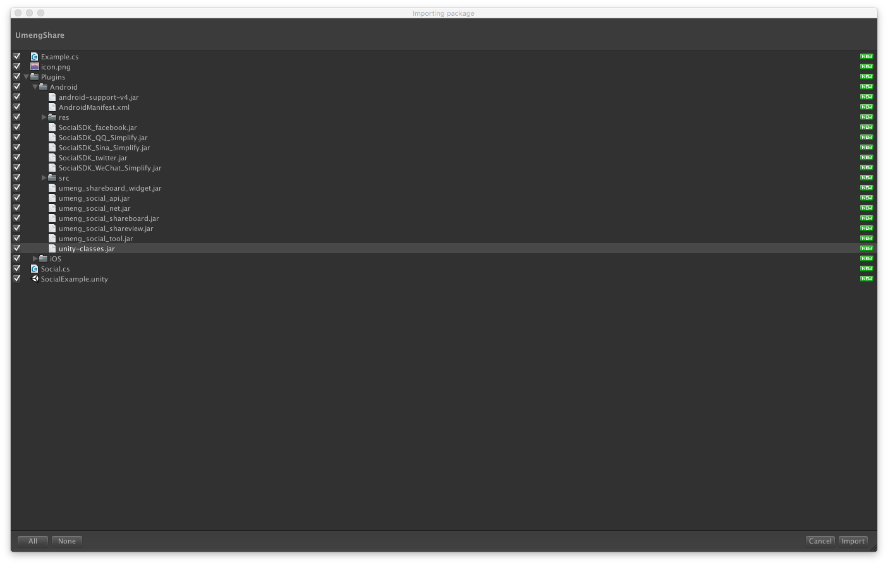

## Unity接入友盟分享(Android)
最近几天接入了友盟分享，还是有很多注意点的，这边记录一下。  
我接入的版本是  
`社会化组件Unity3D v6.3.0`  
#### 1.首先导入工程包。  
  
> 这里注意把unity-classes.jar勾选掉，不然会报jar包重复的错误，因为因为编译的时候unity自动链接到自己的class.jar文件。另外其他的jar包和图片资源可以根据自己需求去掉一部分不需要的。  

#### 2.接下来就开始接入了。  
> [官网的接入指引](http://dev.umeng.com/social/unity3d/android) 是假定我们导出android工程再进行接入的，所以他们的unitypackage才会有unity-classes.jar和一些java 文件。  
> 我们如果直接在unity中打包出apk文件，则需要先在eclipse或者AS中把需要调用的方法打包进jar包中，然后导出来供unity使用。  

#### 3.AndroidMainfest的配置  
根据官网指引配置AndroidMainfest。  
最好是对照着导入的AndroidMainfest进行配置。  
注意以下几点:  
> * 权限添加  
* 友盟Key的更改(iOS端写在了代码里,而android写在了配置文件里)  
* 屏幕方向的更改 portrait 还是 landscape 等
* 微信的回调入口activity，改为  自己包名.wxapi.WXEntryActivity (当然这个需要导出对应jar包)
* 检查一遍  

#### 4.在MainActivity里加入回调，导出对应jar  
**[MainActivity](./代码文件夹/友盟分享/MainAdsActivity.java)**

	//	友盟回调以及初始化key
    public void InitUmengKey(String QqKey,String QqSecret,String WeixinKey,String WeixinSecret,String SinaKey,String SinaSecret) {
    	Log.e("umeng","YXC   初始化Key");
	     Config.shareType = "u3d";
	     UMShareAPI.get(this);
	     Config.REDIRECT_URL = "http://sns.whalecloud.com/sina2/callback";
    	
        PlatformConfig.setSinaWeibo(SinaKey, SinaSecret);
        PlatformConfig.setQQZone(QqKey, QqSecret);
        PlatformConfig.setWeixin(WeixinKey,WeixinSecret);
	}
	@Override
	protected void onActivityResult(int requestCode, int resultCode, Intent data) {
	    // TODO Auto-generated method stub
	    super.onActivityResult(requestCode, resultCode, data);
	    UMShareAPI.get(this).onActivityResult(requestCode, resultCode, data);
	}
为什么刚刚更改AndroidMainfest的时候没有更改对应的Activity的名字呢，友盟很聪明的将调用都写成了静态类，这样我们只需打开他的src文件直接导出jar包就能直接调用了，只有微信回调入口的activity需要注意下。  
如图，导出这两个jar包  
  
#### 5.unity端当然是需要umeng自己的jar包啦  
  
这个在导入umengshare.package的时候就会自动导入  
#### 6.unity端的调用  
友盟建议继承application并在里面配置分享的Key，但是这样就不方便在unity端更改key，所以我自己写了初始化key的方法
  
	using UnityEngine;
	using System.Runtime.InteropServices;
	using System;
	using System.Collections.Generic;
	public class UshareCallAndroid
	{
		public static void InitUmengKey (string[] key)
		{
			#if UNITY_ANDROID
			using (AndroidJavaClass unityPlayer = new AndroidJavaClass("com.unity3d.player.UnityPlayer")) {
				AndroidJavaObject curActivity = unityPlayer.GetStatic<AndroidJavaObject> ("currentActivity");
				Debug.Log ("YXC" + "  Umeng Call android InitKey");
				curActivity.Call ("InitUmengKey", key [0], key [1], key [2], key [3], key [4], key [5]);
			}
			#elif UNITY_IPHONE
			InitUmengKeyiOS (key [0], key [1], key [2], key [3], key [4], key [5], Myparameters.Umeng_key);
			#endif
		}
		[DllImport("__Internal")]
		static extern void InitUmengKeyiOS (string QqKey, string QqSecret, string WeixinKey, string WeixinSecret, string SinaKey, string SinaSecret, string UmengKey);
	}
调用一定要先保证`InitUmengKey `后再调用友盟social脚本里的分享方法。可以参考[TjSdk](https://git.oschina.net/yuanxinchao/TjSdk)工程里的UmengShare.cs的调用。  
#### 7.遇到的问题  
>* 在使用新浪分享的时候报redirect url错误，可以去新浪后台核实回调地址是否正确。  
* sso package error  签名错误，核实新浪后台签名是否正确。   
 核实方法，  
 可以在手机安装需要需要接入新浪分享的安装包，  
 然后下载MD5签名查看apk，输入对应包名。  
 对比得到的签名是否与新浪后台填写的一致。