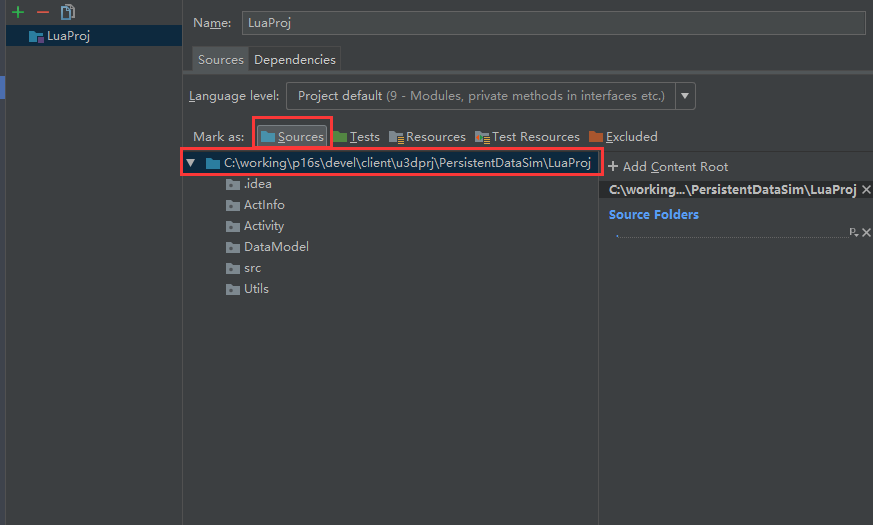

#### 参考文章：在Unity中调试Lua：IntelliJ IDEA + EmmyLua
[http://blog.csdn.net/david_dai_1108/article/details/74279111](http://blog.csdn.net/david_dai_1108/article/details/74279111)  

  

注意：source 设置为整个lua项目，最后调试出结果。  
   
直接看结果美滋滋~~~   

如果想快速写个逻辑看结果可使用notepad+lua.exe  
  
大概配置步骤分为：  
1.下载lua  
2.配置lua的全局变量  
3.设置notepad 的运行快捷键配置为`cmd /k lua "$(FULL_CURRENT_PATH)"形式`  
4.运行就ok了  

### IntelliJ IDEA 编辑器快捷键 ###  

* Ctrl＋F7可以查询当前元素在当前文件中的引用
* Ctrl+Alt+ left/right 返回至上次浏览的位置