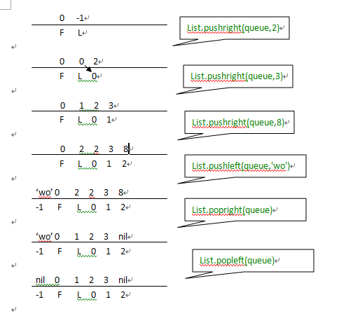

	List = {}
	function List.new ()
	    return {first = 0, last = -1}
	end
	function List.pushleft (list, value)
	    local first = list.first - 1
	    list.first = first
	    list[first] = value
	end
	 
	function List.pushright (list, value)
	    local last = list.last + 1
	    list.last = last
	    list[last] = value
	end
	 
	function List.popleft (list)
	    local first = list.first
	    if first > list.last then error("list is empty") end
	    local value = list[first]
	    list[first] = nil    -- to allow garbage collection
	    list.first = first + 1
	    return value
	end
	 
	function List.popright (list)
	    local last = list.last
	    if list.first > last then error("list is empty") end
	    local value = list[last]
	    list[last] = nil     -- to allow garbage collection
	    list.last = last - 1
	    return value
	end
	queue = List.new()
	
	List.pushright(queue,2)
	List.pushright(queue,3)
	List.pushright(queue,8)
	List.pushleft(queue,'wo')
	List.popright(queue)
	List.popleft(queue)
	for k,v in pairs(queue) do
		print(k,v)
	end
操作如图：  

对严格意义上的队列来讲，我们只能调用pushright和popleft，这样以来，first和last的索引值都随之增加，幸运的是我们使用的是Lua的table实现的，你可以访问数组的元素，通过使用下标从1到20，也可以16,777,216 到 16,777,236。另外，Lua使用双精度表示数字，假定你每秒钟执行100万次插入操作，在数值溢出以前你的程序可以运行200年。