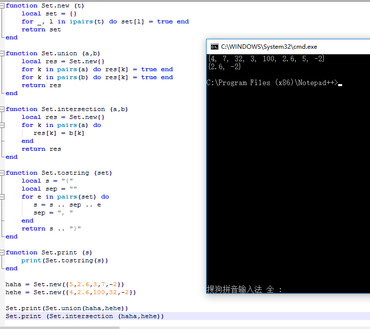

取交并集
	
	Set = {}
 
	function Set.new (t)
	    local set = {}
	    for _, l in ipairs(t) do set[l] = true end
	    return set
	end
	 
	function Set.union (a,b)
	    local res = Set.new{}
	    for k in pairs(a) do res[k] = true end
	    for k in pairs(b) do res[k] = true end
	    return res
	end
	 
	function Set.intersection (a,b)
	    local res = Set.new{}
	    for k in pairs(a) do
	       res[k] = b[k]
	    end
	    return res
	end

	function Set.tostring (set)
	    local s = "{"
	    local sep = ""
	    for e in pairs(set) do
	       s = s .. sep .. e
	       sep = ", "
	    end
	    return s .. "}"
	end
	 
	function Set.print (s)
	    print(Set.tostring(s))
	end

	
	haha = Set.new{5,2.6,3,7,-2}
	hehe = Set.new{4,2.6,100,32,-2}
	
	Set.print(Set.union(haha,hehe))
	Set.print (Set.intersection (haha,hehe))
重载运算符:  

	Set = {}
	Set.mt = {}       -- metatable for sets
	function Set.new (t)
		local set = {}
		setmetatable(set, Set.mt)
		Set.mt.__add = Set.union
		Set.mt.__mul = Set.intersection
		Set.mt.__tostring = Set.tostring--重写tostring方法，print可直接打印
		for _, l in ipairs(t) do set[l] = true end
		return set
	end
	.
	.
	.
	haha = Set.new{5,2.6,3,7,-2}
	hehe = Set.new{4,2.6,100,32,-2}
	
	Set.print(haha+hehe)
	Set.print (haha*hehe)
	print(haha+hehe) --用print直接打印时会先去找对应matetable里是否有tostring方法
	print (haha*hehe)