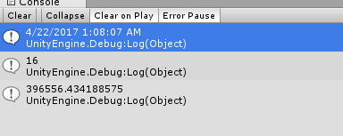

## Datatime相关API   ##
####  DateTime转字符串 ####

    DateTime dt = new DateTime(2018,1,22,10,24,34);
    Debug.Log(dt.ToString());
    Debug.Log(dt.ToString("HH:mm:ss"));
    Debug.Log(dt.ToString(new CultureInfo("hr-HR")));  

---
#### 字符串转DateTime ####

    DateTime dt = new DateTime(2018,1,22,10,24,34);
    string dtString = dt.ToString();//要想转回DateTime最好使用默认的ToString()
    DateTime dt2 =  Convert.ToDateTime(dtString);
    Debug.Log(dt2.ToString());

---
#### 加上一段时间 ####
    DateTime dt = new DateTime(2018,1,22,10,24,34);
    dt= dt.Add(new TimeSpan(0,5,0));//加0小时5分0秒
    Debug.Log(dt.ToString());

---
#### 两个时间的差 ####
    DateTime dt = new DateTime(2018,1,22,10,24,34);
    DateTime dtNow = System.DateTime.Now;
    Debug.Log(dtNow.ToString());
    TimeSpan ts = dt - dtNow;
    if (ts > TimeSpan.Zero)
    {
        Debug.Log(ts.Minutes);
        Debug.Log(ts.TotalMinutes);
    }
输出如图:  
