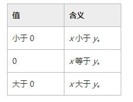

## Comparison<T> 委托
[官网api](https://msdn.microsoft.com/zh-cn/library/tfakywbh(v=vs.110).aspx)  

	public delegate int Comparison<in T>(
		T x,
		T y
	)

  

栗子：  

	_rewards.Sort((a, b) => a.state-b.state);//按照领奖状态排序