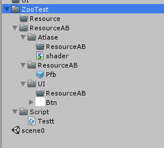
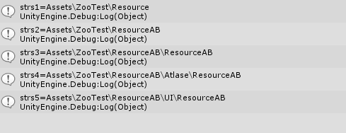
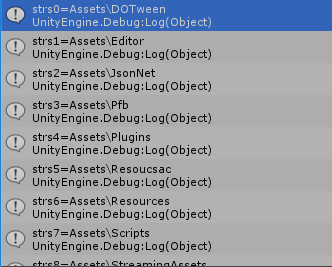

## Directory 类  
#### GetDirectories(String, String, SearchOption)  

语法：  

	public static string[] GetDirectories(
		string path,
		string searchPattern,
		SearchOption searchOption
	)
参数1：要搜索的目录的相对路径或绝对路径。不区分大小写  
参数2：要与**path中子目录**名称匹配的搜索字符串。可包含有效文本和通配符"?","*"，不支持正则。  
参数3：返回第一个满足searchPattern的，或者所有满足的。  
返回值：字符串数组，未找到任何目录则返回空数组。  
 
通配符说明符|匹配
--|--
*（星号）|在该位置的零个或多个字符。
?（问号）|在该位置的零个或一个字符。  
#### 栗子：  
    string[] strs = Directory.GetDirectories("Assets", "Resou*", SearchOption.AllDirectories);
    for (int i = 0; i < strs.Length; i++)
    {
        Debug.Log("strs" + i + "=" + strs[i]);
    }

搜索相对路径Assets下，所有以Resou开头的路径。  

  

结果为：  
   

* 可以看到嵌套的ResourceAB也被搜索到了。  
* 如果SearchOption改为TopDirectoryOnly 就只会返回一级子目录下符合searchPattern 的所有路径。  
* 其两个重载方法 GetDirectories("Assets") 返回一级子目录所有的文件夹路径。如下图  
   
* `GetDirectories("Assets","Resou*") 与
Directory.GetDirectories("Assets", "Resou*", SearchOption.TopDirectoryOnly);`相同只会从一级子目录中搜索匹配文件夹.

---
#### GetFiles(String)
用法和GetDirectories类似，也有其余两个重写的方法。只不过这里get到的是file而不是文件夹

---
#### GetCurrentDirectory()  
获取程序当前工作路径,是绝对路径.
