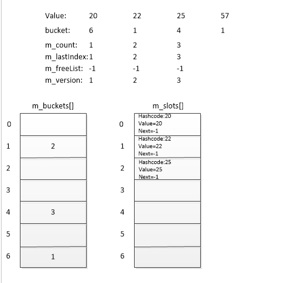
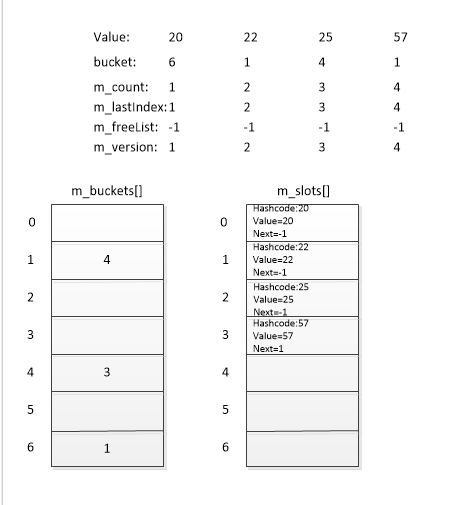

## HashSet<T> 类
官网API->栗子->源码解析

[参考官网](https://msdn.microsoft.com/zh-cn/library/bb359438.aspx#%E6%98%BE%E5%BC%8F%E6%8E%A5%E5%8F%A3%E5%AE%9E%E7%8E%B0)   

#### HashSet<T>.Add 方法 (T)  
**1.官网API**

	public bool Add(
		T item
	)
参数：要添加到集中的元素。  
返回值：如果该元素添加到 HashSet<T> 对象中则为 true；如果该元素已存在则为 false。  
**2.栗子**：  

    HashSet<Student> stus = new HashSet<Student>();
    stus = new HashSet<Student>();
    Student s = new Student(){name = "xiaoming"};
    Console.WriteLine(stus.Add(s));
这里返回true。  

**3.源码解析**：  

    /// 

    /// Add item to this HashSet. Returns bool indicating whether item was added (won't be 
    /// added if already present)
    /// 

    /// <param name="item"></param>
    /// <returns>true if added, false if already present</returns>
    public bool Add(T item) {
        return AddIfNotPresent(item);
    }

-

	       private bool AddIfNotPresent(T value) {
	            if (m_buckets == null) {
	                Initialize(0);
	            }
	 
	            int hashCode = InternalGetHashCode(value);
	            int bucket = hashCode % m_buckets.Length;
	#if FEATURE_RANDOMIZED_STRING_HASHING && !FEATURE_NETCORE
	            int collisionCount = 0;
	#endif
	            for (int i = m_buckets[hashCode % m_buckets.Length] - 1; i >= 0; i = m_slots[i].next) {
	                if (m_slots[i].hashCode == hashCode && m_comparer.Equals(m_slots[i].value, value)) {
	                    return false;
	                }
	#if FEATURE_RANDOMIZED_STRING_HASHING && !FEATURE_NETCORE
	                collisionCount++;
	#endif
	            }
	 
	            int index;
	            if (m_freeList >= 0) {
	                index = m_freeList;
	                m_freeList = m_slots[index].next;
	            }
	            else {
	                if (m_lastIndex == m_slots.Length) {
	                    IncreaseCapacity();
	                    // this will change during resize
	                    bucket = hashCode % m_buckets.Length;
	                }
	                index = m_lastIndex;
	                m_lastIndex++;
	            }
	            m_slots[index].hashCode = hashCode;
	            m_slots[index].value = value;
	            m_slots[index].next = m_buckets[bucket] - 1;
	            m_buckets[bucket] = index + 1;
	            m_count++;
	            m_version++;
	 
	#if FEATURE_RANDOMIZED_STRING_HASHING && !FEATURE_NETCORE
	            if(collisionCount > HashHelpers.HashCollisionThreshold && HashHelpers.IsWellKnownEqualityComparer(m_comparer)) {
	                m_comparer = (IEqualityComparer<T>) HashHelpers.GetRandomizedEqualityComparer(m_comparer);
	                SetCapacity(m_buckets.Length, true);
	            }
	#endif // FEATURE_RANDOMIZED_STRING_HASHING
	 
	            return true;
	        }

  
如图。因为int的hashcode就是本身，所以在插入20,22,25三个int型的value的时候，结果如上图。存储的值对数组长度取余对应m_buckets数组索引。m_buckets数组的值为m_slots数组的索引(-1后为真正的索引)。当存储的值发生碰撞时。即存入57时。  
  
因为57的余数也是1(即bucket)，按照源码的处理m_slots[3].next = m_buckets[1]-1 即为1，然后将m_buckets[1]赋值为index+1 即为4，这里就处理了碰撞。也将碰撞的值的索引保存在了Next中，后来遇到的碰撞也这么处理。当m_slots的容量到达上限的时候就会调用IncreaseCapacity方法将容量扩充至下一个素数。这时候会将m_buckets的值重新计算。(因为取余的值变了)

#### HashSet<T>.Contains 方法 (T)
**1.官网API**

	public bool Contains(
		T item
	)  

参数：要在 HashSet<T> 对象中查找的元素。  
返回值：如果 HashSet<T> 对象包含指定的元素，则为 true；否则为 false。  

实现的是ICollection里的Contains接口：  
ICollection<T>.Contains(T)  
方法复杂度O(1)。  

**2.栗子**：  

    HashSet<Student> stus = new HashSet<Student>();
    stus = new HashSet<Student>();
    Student s = new Student(){name = "xiaoming"};
    stus.Add(s);
    Console.WriteLine(stus.Contains(s));
这里返回true。  

**3.源码解析**：  
