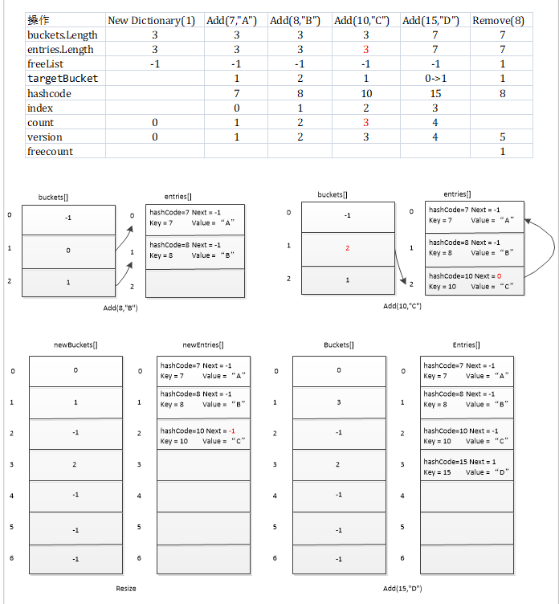
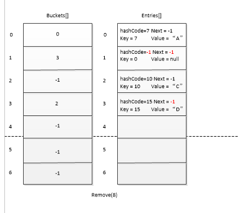

## Dictionary 类
源码解析

[参考官网源码](https://referencesource.microsoft.com/#mscorlib/system/collections/generic/dictionary.cs,998e5f475d87f454)   

如图：空白地方表示不操作该字段  
注意以下几点：  
1.Dictionary的核心代码的实现和HashSet类似。只不过多了Value类型存值。且在存入已有key时处理不同，hashset是忽略，而Dictionary是报错。  
2.新建的bucket和entries大小是传入参数的下一个素数值。比如New Dictionary(1)，则bucket和entries大小是3
3.见Add(10,"C")。当发生hash碰撞时，bucket和对应entries.next引用替换。  
3.见Resize。当大小不够扩容时，对于bucket和entries.Next的引用都要重新替换。  
4.Add是会判断key是否已经存在，如上图Add(15,"D")时,targetBucket = 15/3 =0; 然后检查buckets[0]=-1，没问题。但是在添加时发现大小不够。这是调用Resize扩容后，targetBucket = 15/7 = 1。这就是上面为什么写0->1。  

5.Remove(8)。如上图：移除后原来储存key=8的Entries[1]的hashcode变为-1，key和value都变为default值。**值得注意的是Next指向的值变为freelist(这里为-1)**，然后freelist变为1(当前索引),freecount变为1，所以下次Remove时，我们可以知道那个被Remove的Entries.next就变成了1，freecount变为2  
6.上面的对于freelist的处理很机智。这样当Add时判断freecount>0时，index赋值为freelist，当前的freelist赋值为entries[index].next，就可以找到下一个空下来的位置索引。   
7.反正到处都透露着链表的思想。  
8.当我们拿dic的大小时，实际上是dic.Count = count - freecount;