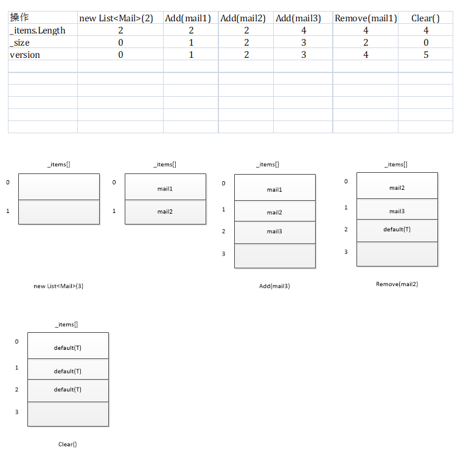

## List 类
源码解析

[参考官网源码](https://referencesource.microsoft.com/#mscorlib/system/collections/generic/list.cs)   

####1.构造  

	List<Student> s = new List<Student>(10)  
源码：
  
    public List(int capacity) {
        if (capacity < 0) ThrowHelper.ThrowArgumentOutOfRangeException(ExceptionArgument.capacity, ExceptionResource.ArgumentOutOfRange_NeedNonNegNum);
        Contract.EndContractBlock();

        if (capacity == 0)
            _items = _emptyArray;
        else
            _items = new T[capacity];
    }
解析：  
1.参数小于0会抛出异常  
2.会新建一个数量为capacity的泛型数组  

#### Add(T item)

    public void Add(T item) {
        if (_size == _items.Length) EnsureCapacity(_size + 1);
        _items[_size++] = item;
        _version++;
    }

* **EnsureCapacity(int)**  

1.不传参构造或传参数0构造list，首次add时容量不够，会新建_defaultCapacity空间，即4
2.add时容量不够且容量不为0时，会将当前list的容量**翻倍**作为新的容量。  
3.如果容量翻倍后大于int型范围的上限会将其大小限制在Array.MaxArrayLength内  
4.所以list扩充容量的方式是**翻倍翻倍翻倍**  
5.T[] newItems = new T[value];扩容时会申请空间。并且把老数据拷贝一下，所以有很大的性能开销

#### Remove(T item)

    public bool Remove(T item) {
        int index = IndexOf(item);
        if (index >= 0) {
            RemoveAt(index);
            return true;
        }

        return false;
    }
    public void RemoveAt(int index) {
        if ((uint)index >= (uint)_size) {
            ThrowHelper.ThrowArgumentOutOfRangeException();
        }
        Contract.EndContractBlock();
        _size--;
        if (index < _size) {
            Array.Copy(_items, index + 1, _items, index, _size - index);
        }
        _items[_size] = default(T);
        _version++;
    }
1.`IndexOf`其实就是进行遍历，判断相等后返回index，找不到返回-1。  
2.Remove成功返回true，失败返回false。  
3.RemoveAt操作会调用`Array.Copy`，即移除掉一个值后，后面的值会依次向前移动一格。  
4.RemoveRange同理

####Count  

    public int Count {
        get {
            Contract.Ensures(Contract.Result<int>() >= 0);
            return _size; 
        }
    }
返回_size。  
_size值指代存储了多少个数据。capacity则是list的容量。
####Clear()  

	public void Clear() {
	    if (_size > 0)
	    {
	        Array.Clear(_items, 0, _size); // Don't need to doc this but we clear the elements so that the gc can reclaim the references.
	        _size = 0;
	    }
	    _version++;
	}

可以看到Clear只是将已存的值全部设为default(T)，而没有改变容量大小，这很好理解，因为这个List有很大可能重复使用。

####List[]  
获取某个索引：

	public T this[int index] {
	    get {
	        // Following trick can reduce the range check by one
	        if ((uint) index >= (uint)_size) {
	            ThrowHelper.ThrowArgumentOutOfRangeException();
	        }
	        Contract.EndContractBlock();
	        return _items[index]; 
	    }
	
	    set {
	        if ((uint) index >= (uint)_size) {
	            ThrowHelper.ThrowArgumentOutOfRangeException();
	        }
	        Contract.EndContractBlock();
	        _items[index] = value;
	        _version++;
	    }
	}  
理论上容量范围内我都可以获取索引只不过没存值的会返会default(T)。  
**get**实际上如果你只存了三个数据(_size=2)但是取第四个数据(index=3)List[3]是没有意义的，所以程序上杜绝了这种操作(会ThrowArgumentOutOfRangeException)。  
**set**同理，所以乖乖用add吧