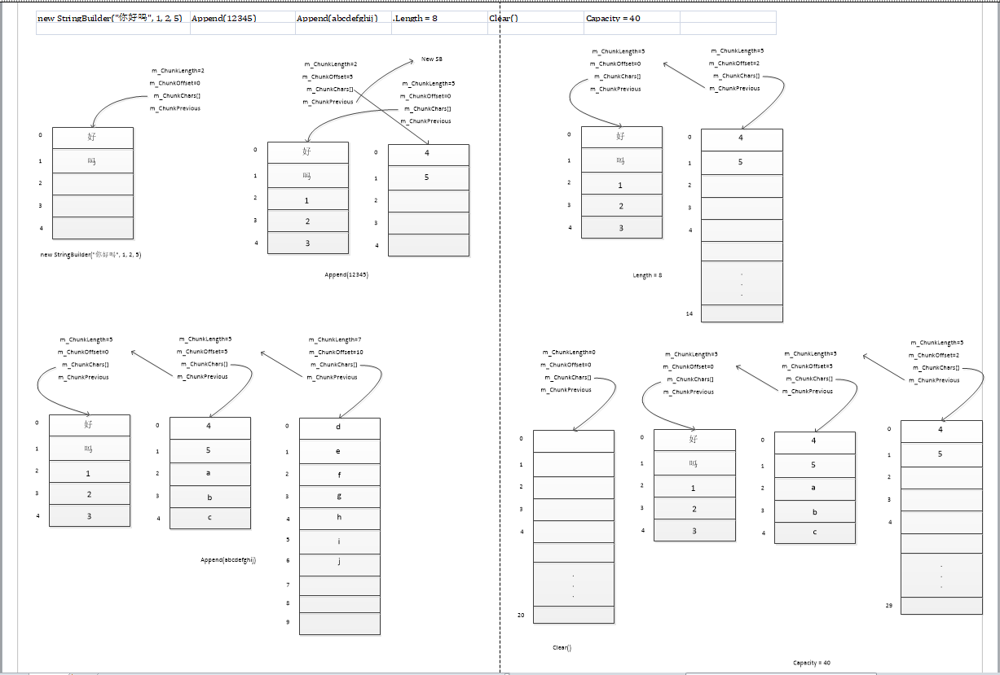
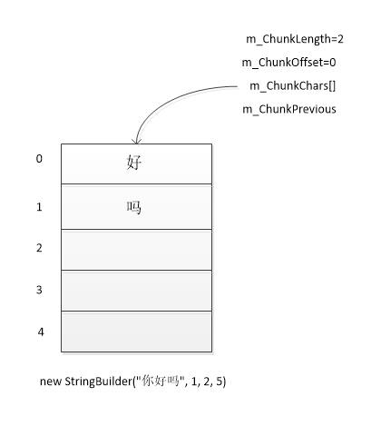
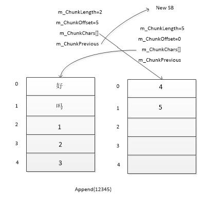
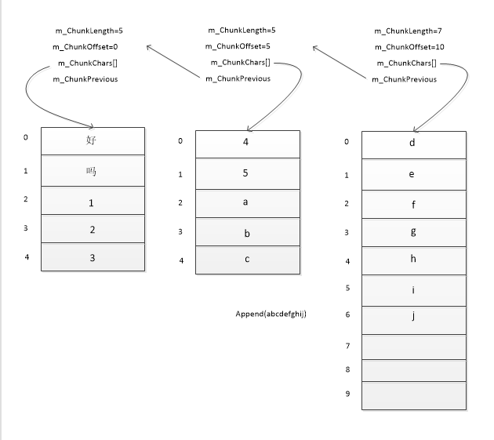
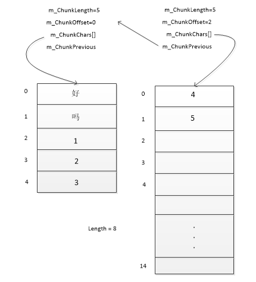
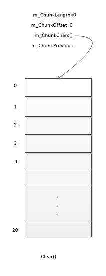
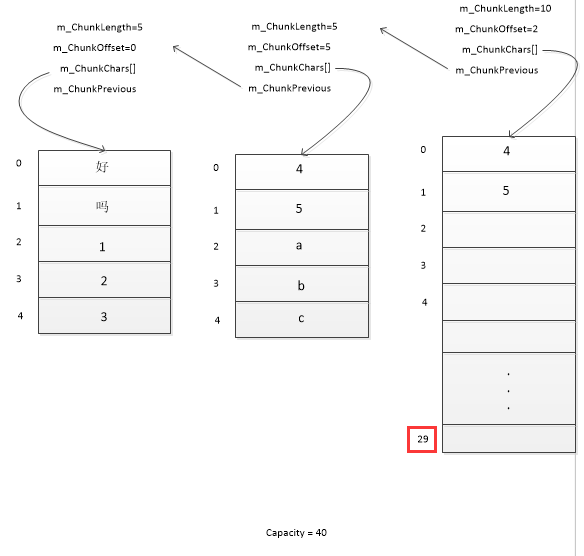

## StringBuilder
源码解析

[参考官网源码](https://referencesource.microsoft.com/#mscorlib/system/text/stringbuilder.cs)   

写在前面：SB容量不足时会使用链表方式扩容。(m_ChunkOffset + m_ChunkLength 定位位置)
  
visio文件夹StringBuilder.vsd 查看详图
####1.构造  
	new StringBuilder("你好吗", 1, 2, 5);
* "你好吗" index 取1，长度取2(越界会报错),SB容量为5。  
	  

**核心源码：**

	m_ChunkChars = new char[capacity];
	m_ChunkLength = length;
	
	unsafe {
	    fixed (char* sourcePtr = value)
	        ThreadSafeCopy(sourcePtr + startIndex, m_ChunkChars, 0, length);
	}
含参的构造会调用`ThreadSafeCopy`方法调用`string.wstrcpy`方法调用`Memmove(byte* dest, byte* src, nuint len)`方法。  
ThreadSafeCopy核心代码：  

	*(int*)dest = *(int*)src;
	*(int*)(dest + 4) = *(int*)(src + 4);
	*(int*)(dest + 8) = *(int*)(src + 8);
	*(int*)(dest + 12) = *(int*)(src + 12);
	*(int*)(dest + 16) = *(int*)(src + 16);
	*(int*)(dest + 20) = *(int*)(src + 20);
	*(int*)(dest + 24) = *(int*)(src + 24);
	...
	...

解析：

* 以第二行为例:src是源字串指针(byte),+4代表索引移动4\*Size(byte)个字节,(int\*)表示强制转换成int型指针，最前面的\*代表取地址值，含义：将src指针向后偏移四个字节地址取值赋给dest指针向后偏移4个字节后指向的地址。   
* 复制超过2048个字节时会调用外部方法。  

#### Append(String value)  
栗子：

	Append(12345);

如容量足够时，会直接调上述的`string.wstrcpy`复制过去。不够时调`Append(char* value, int valueCount)`将m_ChunkChars填满再调`ExpandByABlock`扩容

#### 接上Append(char* value, int valueCount)  
源码：  

	public unsafe StringBuilder Append(char* value, int valueCount)
	{
	    // We don't check null value as this case will throw null reference exception anyway
	    if (valueCount < 0)
	    {
	        throw new ArgumentOutOfRangeException("valueCount", Environment.GetResourceString("ArgumentOutOfRange_NegativeCount"));
	    }
	
	    // This case is so common we want to optimize for it heavily. 
	    int newIndex = valueCount + m_ChunkLength;
	    if (newIndex <= m_ChunkChars.Length)
	    {
	        ThreadSafeCopy(value, m_ChunkChars, m_ChunkLength, valueCount);
	        m_ChunkLength = newIndex;
	    }
	    else
	    {
	        // Copy the first chunk
	        int firstLength = m_ChunkChars.Length - m_ChunkLength;
	        if (firstLength > 0)
	        {
	            ThreadSafeCopy(value, m_ChunkChars, m_ChunkLength, firstLength);
	            m_ChunkLength = m_ChunkChars.Length;
	        }
	
	        // Expand the builder to add another chunk. 
	        int restLength = valueCount - firstLength;
	        ExpandByABlock(restLength);
	        Contract.Assert(m_ChunkLength == 0, "Expand did not make a new block");
	
	        // Copy the second chunk
	        ThreadSafeCopy(value + firstLength, m_ChunkChars, 0, restLength);
	        m_ChunkLength = restLength;
	    }
	    VerifyClassInvariant();
	    return this;
	}
扩容核心代码：  

	int newBlockLength = Math.Max(minBlockCharCount, Math.Min(Length, MaxChunkSize));
    m_ChunkPrevious = new StringBuilder(this);
    m_ChunkOffset += m_ChunkLength;
    m_ChunkLength = 0;

    // Check for integer overflow (logical buffer size > int.MaxInt)
    if (m_ChunkOffset + newBlockLength < newBlockLength)
    {
        m_ChunkChars = null;
        throw new OutOfMemoryException();
    }
    m_ChunkChars = new char[newBlockLength];
  
解析：如图，扩容部分`new SB`将Oringin_SB(Length,offset)复制给New_SB,(包括m_ChunkChars的引用),Oringin_SB的m_ChunkPrevious指向New_SB,新建一个char[]给Oringin_SB的m_ChunkChars。  
我们再

	Append("abcdefghij");  
结果如下图：  
  

    int firstLength = m_ChunkChars.Length - m_ChunkLength;
    if (firstLength > 0)
    {
        ThreadSafeCopy(value, m_ChunkChars, m_ChunkLength, firstLength);
        m_ChunkLength = m_ChunkChars.Length;
    }
**总结**：

* append"abcdefghij"时(长度10)，先是将abc填充到剩余的空间，restLength剩7，进入扩容代码。  
* 注意填充时m_ChunkLength更新为了5
* 扩容大小newBlockLength是取 **剩余字串长度7** 与 **已填充长度10**(Length = m_ChunkOffset+m_ChunkLength=5+5 = 10) **比较**取最大值10，所以扩容大小是10。  
* 所以设置SB的容量时尽量设置的大一点，避免GC。
#### Length
源码： 

	public int Length {
	    get {
	        Contract.Ensures(Contract.Result<int>() >= 0);
	        return m_ChunkOffset + m_ChunkLength;
	    }
	    set {
	        //If the new length is less than 0 or greater than our Maximum capacity, bail.
	        if (value<0) {
	            throw new ArgumentOutOfRangeException("value", Environment.GetResourceString("ArgumentOutOfRange_NegativeLength"));
	        }
	
	        if (value>MaxCapacity) {
	            throw new ArgumentOutOfRangeException("value", Environment.GetResourceString("ArgumentOutOfRange_SmallCapacity"));
	        }
	        Contract.EndContractBlock();
	
	        int originalCapacity = Capacity;
	
	        if (value == 0 && m_ChunkPrevious == null)
	        {
	            m_ChunkLength = 0;
	            m_ChunkOffset = 0;
	            Contract.Assert(Capacity >= originalCapacity, "setting the Length should never decrease the Capacity");
	            return;
	        }
	
	        int delta = value - Length;
	        // if the specified length is greater than the current length
	        if (delta > 0)
	        {
	            // the end of the string value of the current StringBuilder object is padded with the Unicode NULL character
	            Append('\0', delta);        // We could improve on this, but who does this anyway?
	        }
	        // if the specified length is less than or equal to the current length
	        else
	        {
	            StringBuilder chunk = FindChunkForIndex(value);
	            if (chunk != this)
	            {
	                // we crossed a chunk boundary when reducing the Length, we must replace this middle-chunk with a new
	                // larger chunk to ensure the original capacity is preserved
	                int newLen = originalCapacity - chunk.m_ChunkOffset;
	                char[] newArray = new char[newLen];
	
	                Contract.Assert(newLen > chunk.m_ChunkChars.Length, "the new chunk should be larger than the one it is replacing");
	                Array.Copy(chunk.m_ChunkChars, newArray, chunk.m_ChunkLength);
	                
	                m_ChunkChars = newArray;
	                m_ChunkPrevious = chunk.m_ChunkPrevious;                        
	                m_ChunkOffset = chunk.m_ChunkOffset;
	            }
	            m_ChunkLength = value - chunk.m_ChunkOffset;
	            VerifyClassInvariant();
	        }
	        Contract.Assert(Capacity >= originalCapacity, "setting the Length should never decrease the Capacity");
	    }
	}

栗子：

	_sb.Length = 8
  

* 设置Length时不会影响Capacity。
* 如果要设置的长度没有索引到前面的SB(m_ChunkPrevious)，那么直接`m_ChunkLength = xxx - chunk.m_ChunkOffset;`  
* 如果要设置的长度跨越了StringBuilder链表，为了保持Capacity不变，会重新申请空间(Capacity-chunk.m_ChunkOffset)，并且将原来的值复制过去。上述栗子就申请了数组大小为15的空间，将4,5,复制了过来。这里同样会有GC。

#### Clear()  
源码：  

    public StringBuilder Clear() {
        this.Length = 0;
        return this;
    }

* 可以看到其实就是把Length赋0  
* 所以如果有多个链表在的话，还是会新建Capacity数量的数组。  
  

#### Capacity  
源码：  

    public int Capacity {
        get { return m_ChunkChars.Length + m_ChunkOffset; }
        set {
            if (value < 0) {
                throw new ArgumentOutOfRangeException("value", Environment.GetResourceString("ArgumentOutOfRange_NegativeCapacity"));
            }
            if (value > MaxCapacity) {
                throw new ArgumentOutOfRangeException("value", Environment.GetResourceString("ArgumentOutOfRange_Capacity"));
            }
            if (value < Length) {
                throw new ArgumentOutOfRangeException("value", Environment.GetResourceString("ArgumentOutOfRange_SmallCapacity"));
            }
            Contract.EndContractBlock();

            if (Capacity != value) {
                int newLen = value - m_ChunkOffset;
                char[] newArray = new char[newLen];
                Array.Copy(m_ChunkChars, newArray, m_ChunkLength);
                m_ChunkChars = newArray;
            }
        }
    }

* 设置的值如果小于Length会报错。  
* 实际上是新申请xxx - m_ChunkOffset 个数组空间，然后把当前m_ChunkChars[]数组中的值复制过去。  
* 所以是有GC的。  

栗子：

	Capacity = 40  

结果如图：  
