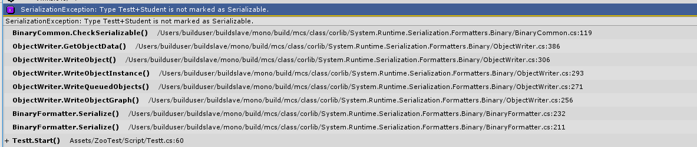
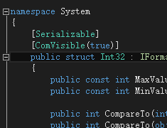

## SerializableAttribute 
官网API->栗子->源码解析
[参考官网](https://msdn.microsoft.com/en-us/library/system.serializableattribute.aspx)   

**1.官网API**

    [AttributeUsage(AttributeTargets.Class | AttributeTargets.Struct | AttributeTargets.Enum | AttributeTargets.Delegate, Inherited = false)]
	[System.Runtime.InteropServices.ComVisible(true)]
    public sealed class SerializableAttribute : Attribute 
    {
        internal static Attribute GetCustomAttribute(RuntimeType type) 
        { 
            return (type.Attributes & TypeAttributes.Serializable) == TypeAttributes.Serializable ? new SerializableAttribute() : null; 
        }
        internal static bool IsDefined(RuntimeType type) 
        { 
            return type.IsSerializable; 
        }
 
        public SerializableAttribute() {
        }
    }

* 该特性可以应用到上述代码中的几个类型。 注意没有方法类型(即方法不能序列化) 
* 标记了改特性的类型被继承时不继承该属性(Inherited = false)。 

**2.栗子**：   

    [Serializable]
    public class Student
    {
        public Student Friend;
        public int Age;
        public bool Sex;//true 男
        public string Name;
    }
 

**3.源码解析**： 

见上述1.官网api

注意：不加此特性的类被序列化时会报错。可以通过添加[NonSerialized]特性使变量不进行序列化  
  
可以看到调用到CheckSerializable时报异常。  
值得注意的是，所有的基本类型都是可以序列化的，不然的话，基本类型组成的一个个类就都不能序列化了。  

下面的示例展示了对自建类的序列化即反序列化

	Student s1= new Student()
	{
	    Name = "lao",
	    Age = 3,
	    Sex = true,
	};
	Student s22= new Student()
	{
	    Name = "xxx",
	    Age = 15,
	    Sex = false,
	};
	s1.Friend = s22;
	Student des;
	if (File.Exists("abc.txt"))
	{
		//var file = File.Open("abc.txt", FileMode.Append);
	    FileStream fs = new FileStream("abc.txt", FileMode.Open);
	    BinaryFormatter bf = new BinaryFormatter();
	    
	    bf.Serialize(fs,s1);
	
	    fs.Position=0;
	    des = (Student)bf.Deserialize(fs);
	    Debug.Log(des.Name);
		//XmlSerializer xml = new XmlSerializer(typeof(Student));
		//xml.Serialize(fs, s1);  
	
	    fs.Close();
	}
	else
	{
	    throw new Exception("请先建立abc.txt然后进行测试");
	}

* **优化:**考虑到性能，序列化前，格式化器(BinaryFomatter)不会验证Object里的所有内容是否都能序列化，所以在抛出SerializationException之前，可能已经将一部分对象序列化到流中，所以比较保险的方式是先序列化到MemoryStream中，如果都ok就将MemoryStream中的字节复制到真正希望的目标流中(比如文件和网络)
* **基类需要可序列化:**SerializableAttribute 不会被派生类继承，所以如果父类加了[Serializable]而子类没加，则子类不能序列化，如果子类加了父类没加，当然子类也不能序列化，因为序列化的对象要求其所引用到的所有对象都应是可序列化的，除非指定[NonSerialized],这也是System.Object很体贴的用了[Serializable]的原因
* **[NonSerialized]标签:**不管是public,protected,internal,private ，序列化会读取对象的所有字段。所以一些敏感信息(密码)可以加上[NonSerialized]  
* **[OnDeserialized]标签:**字段含有容易计算的信息，字段加[NonSerialized],在某个方法加上[OnDeserialized]特性用于反序列化时重新计算该信息。 
* **[OnDeserialized][OnDeserializing][OnSerializing][OnSerialized]标签:**
* **[OptionalField]标签:**版本更新后，某个类型添加了新字段，反序列化原来储存的数据时会报异常，这时在新字段加上该标签即可。  
* **[Iserializable]**