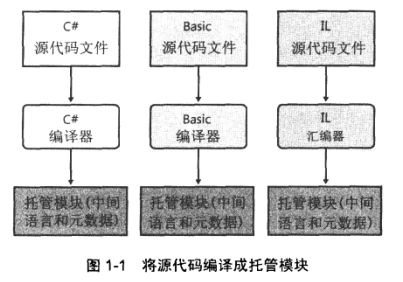

### 1.CLR的执行模型

#### 1.1 将源代码编译成托管模块

CLR中文名**公共语言运行时(Common Language Runtime)**，是一个可由多种编程语言使用的"运行时"。CLR的核心功能

* 内存管理
* 程序集加载
* 安全性
* 异常处理
* 线程同步
* ....

事实上，在运行时，CLR根本不关心开发人员用哪一种语言来写源代码。Microsoft已创建了好几个面向“运行时”的语言编译器，包括

* C++/CLI
* C#
* Visual Basic
* F#
* Iron Python
* Iron Ruby
* Intermediate Language (IL)

还有另一些公司，学院和大学也创建了自己的编译器，它们也能面向CLR来生成代码。如：COBOL，Php，Lua，Smalltalk

这些代码经过编译器变异后都会变成托管模块。

#### 1.2 将托管模块合并成程序集

#### 1.3 加载公共语言运行时

程序集既可以是可执行的应用程序，也可以是一个DLL(由可执行程序使用的类型)。