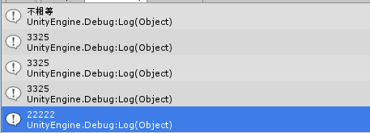

## GetHashCode
参考[csdn](http://blog.csdn.net/xiaof_90/article/details/52037462)  
参考[官网](https://msdn.microsoft.com/zh-cn/library/system.object.gethashcode(v=vs.110).aspx)

The GetHashCode method provides this hash code for algorithms that need quick checks of object equality.  

判断相等，是一种最常见的运算之一。对于整型，浮点型这种值类型，是几就是几。而对于引用类型，为了判断两个对象是不是相等，就需要重写Object.Equals方法——由造物主，也就是你，来规定怎么样的两个对象算是相等的。  

在我们把一个对象添加到一个散列表中时，会先判断这个对象是不是在其中，因为散列表是不允许出现碰撞的。在判断时，并不是直接上来就调用Equals方法，而是会先调用GetHashCode方法，计算出待添加对象的一个散列值：
>
* 如果这个散列值不命中，那就说明这个对象一定不在散列中，可以添加；
* 如果这个散列值命中了，那也不能说明这个对象一定在散列中，因为可能散列值冲突了，所以，要继续调用Equals方法，来看看这个散列值命中的对象，到底在不在散列表里。

对于Equals和GetHashCode的关系，MSDN给出的解释如下：

>If you override the GetHashCode method, you should also override Equals, and vice versa. If your overridden Equals method returns true when two objects are tested for equality, your overridden GetHashCode method must return the same value for the two objects.  

**Equals方法和GetHashCode方法的重写应该同时存在。如果Equals方法返回的结果是true，那么GetHashCode方法返回的结果应该相同。如果GetHashCode方法返回的结果相同，那么Equals方法返回的结果不一定是true。**

    object o1 = 3325;
    object o2 = "he";
    string o3 = "he";
    if (o1.Equals(o2))
    {
        Debug.Log("相等");
    }
    else
    {
        Debug.Log("不相等");
    }
    Debug.Log(o1.GetHashCode());
    Debug.Log(o2.GetHashCode());
    Debug.Log(o3.GetHashCode());
    Hashtable a = new Hashtable();
    a.Add(o1, "11111");
    a.Add(o2, "22222");
    Debug.Log(a[o2]);

