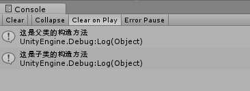

## C# 中子类会继承父类的构造方法

	void Start()
	{
        child p = new child();
	}

    class parent
    {
        protected parent ()
        {
            Debug.Log("这是父类的构造方法");
        }
    }
    class child : parent
    {
        public child():base()
        {
            Debug.Log("这是子类的构造方法");
        }
    }
* 而且会先调用父类的构造方法

* 另外即使不加:base()也会调用
>
    class child : parent
    {
        public child()
        {
            Debug.Log("这是子类的构造方法");
        }
    }