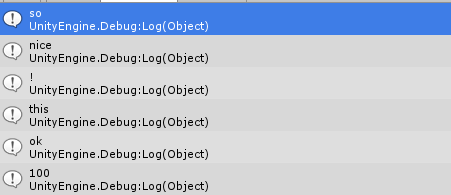

>使用 params 关键字可以指定采用数目可变的参数的方法参数。  
>可以发送参数声明中所指定类型的逗号分隔的参数列表或指定类型的参数数组。 还可以不发送参数。 如果未发送任何参数，则 params 列表的长度为零。

* 在方法声明中的 params 关键字之后不允许有任何其他参数，并且在方法声明中只允许有一个 params 关键字。如` public void Print(params object[] strs,int x)`这种声明是不允许的，因为在传参数的时候编译分不清啊啊。  

**栗子：**  
    void Start()
    {
        Print("so","nice","!");
        PrintObj("this", "ok", 100);
    }

    public void Print(params string[] strs)
    {
        foreach (var str in strs)
        {
            Debug.Log(str);
        }
    }
    public void PrintObj(params object[] strs)
    {
        foreach (var str in strs)
        {
            Debug.Log(str.ToString());
        }
    }
