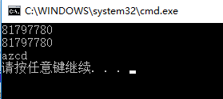
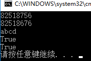

* 字符串内容相同时会共用地址  
>
	string a = "abcd";
	string b = "abcd";
	unsafe
	{
	    fixed (char* pointer = a)
	    {
	        *(pointer + 1) = 'z';
	        Console.WriteLine((int) pointer);
	    }
	    fixed (char* pointer = b)
	        Console.WriteLine((int) pointer);
	    Console.WriteLine(b);
	}
结果：地址相同，改字符串a时，b也变化。  
  

*  比较字符串是否相同时比较的是内容而不是地址  
>
	char[] c = new[] {'a', 'b', 'c', 'd'};
	string a = new string(c);
	string b = "abcd";
	unsafe
	{
	    fixed (char* pointer = a)
	        Console.WriteLine((int) pointer);
	    fixed (char* pointer = b)
	        Console.WriteLine((int) pointer);
	    Console.WriteLine(b);
	    Console.WriteLine(a == b);
	    Console.WriteLine(a.Equals(b));
结果：虽然地址不同，但是内容相同，两个判断都为true。(字符串是存储在常量池中的，只有new出来的两个字符串的引用才是不同的。)  

PS:类的比较是默认比较地址，但是可以通过重写比较方法自己定义相等的条件。类似下面  

	public static bool operator ==(Record rec1, Record rec2)
	{
	    return Object.Equals(rec1, rec2);
	}
PPS：想要使用文章一开始的几行代码需要开启允许不安全代码。开启方法。项目->属性->生成->允许不安全代码