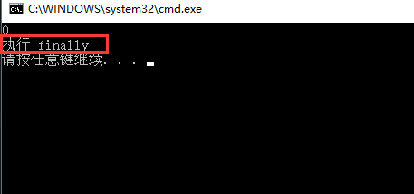

#### 异常处理  
1.try...catch...finally..  
栗子：  

    Student s = null;
    try
    {
        Console.WriteLine(s.age);
    }
    catch (IndexOutOfException)
    {
        Console.WriteLine("捕获到一个异常");
        throw;
    }
	catch{
		Console.WriteLine("捕获到的一个异常");
		throw;
	}
    finally
    {
        Console.WriteLine("执行 finally");
    }
这里我们设置s空引用。结果如图：  
  
捕获到了空指针的异常，并且执行了finally里面的语句。  
当然如果我们代码的第一句是`Student s = new Student()`;  
也就不会出现异常，结果如图：  
  

**所以finally总是会执行。**   

1.通常：finally里的代码应该尽可能短(一到两行),而且要有非常高的成功率。避免finally自己又抛出一个异常。  例:try块里打开一个文件,finally确保文件被关闭。`if(fs!=null) fs.Close()`
2.第二个catch里没有跟括号，意思是前面catch没有覆盖到的异常会在这里被catch到