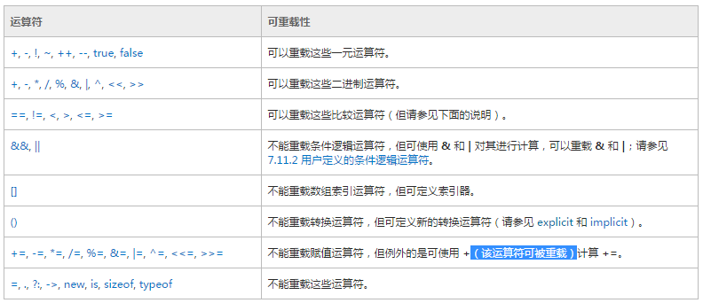

## 运算符重载
在c#里可以对运算符重载

需要注意的：  

>* 重载的符号前加operator修饰
>* 方法为静态
>* 返回类型要对应
>* 还可以重载类型转换

	using System;
	
	public struct Complex 
	{
	   public int real;
	   public int imaginary;
	
	   public Complex(int real, int imaginary) 
	   {
	      this.real = real;
	      this.imaginary = imaginary;
	   }
	
	   // Declare which operator to overload (+), the types 
	   // that can be added (two Complex objects), and the 
	   // return type (Complex):
	   public static Complex operator +(Complex c1, Complex c2) 
	   {
	      return new Complex(c1.real + c2.real, c1.imaginary + c2.imaginary);
	   }
	   // Override the ToString method to display an complex number in the suitable format:
	   public override string ToString()
	   {
	      return(String.Format("{0} + {1}i", real, imaginary));
	   }
	
	   public static void Main() 
	   {
	      Complex num1 = new Complex(2,3);
	      Complex num2 = new Complex(3,4);
	
	      // Add two Complex objects (num1 and num2) through the
	      // overloaded plus operator:
	      Complex sum = num1 + num2;
	
	     // Print the numbers and the sum using the overriden ToString method:
	      Console.WriteLine("First complex number:  {0}",num1);
	      Console.WriteLine("Second complex number: {0}",num2);
	      Console.WriteLine("The sum of the two numbers: {0}",sum);
	 
	   }
	}