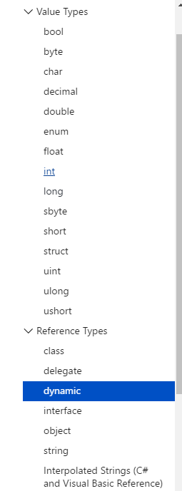
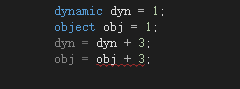

## dynamic
c#基本型里还有包含有一个引用类型，`dynamic`  
  
参照[官网](https://docs.microsoft.com/zh-cn/dotnet/csharp/programming-guide/types/using-type-dynamic)  

该类型是一种静态类型，但类型为 `dynamic` 的对象会跳过静态类型检查，大多数情况下，该对象就像具有类型 object 一样。 在编译时，将假定类型化为 dynamic 的元素支持任何操作。但是，如果代码无效，则在运行时会捕获到错误。

