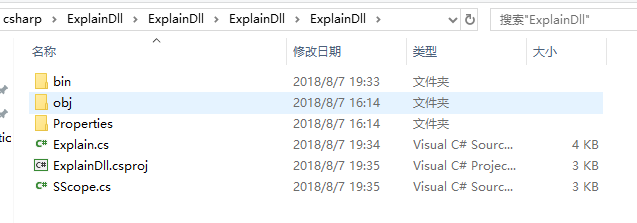
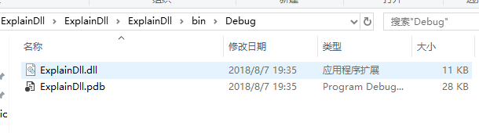
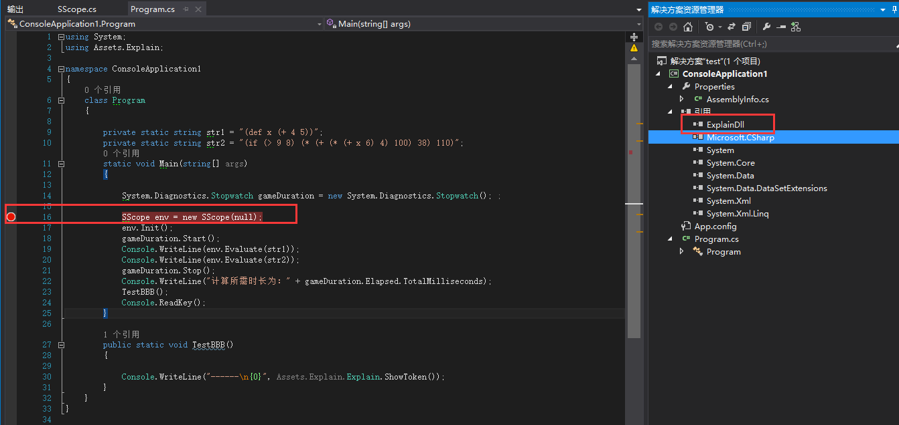
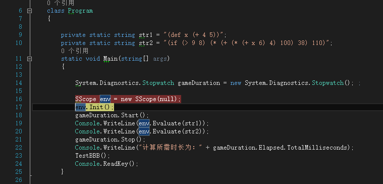
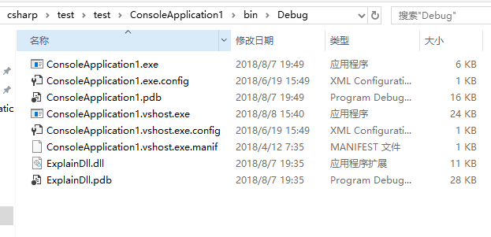
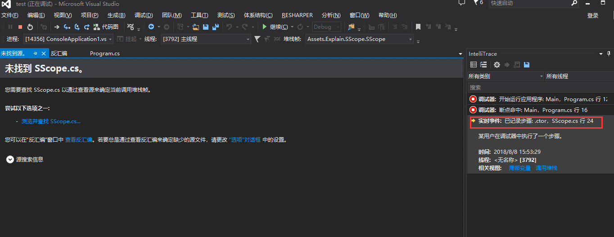
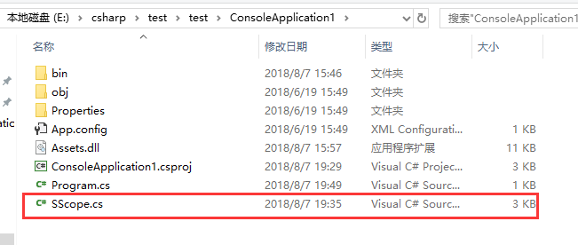
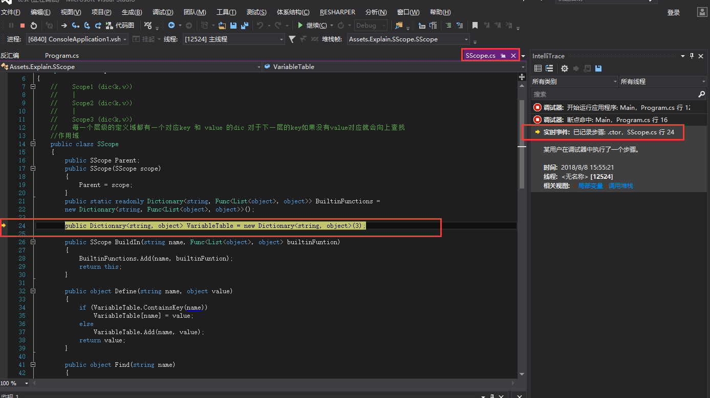

原文：[https://www.wintellect.com/pdb-files-what-every-developer-must-know](https://www.wintellect.com/pdb-files-what-every-developer-must-know)  

### 1.PDB包含的内容 program database  
在C++中，PDB包含很多内容。  

* public，private 和static函数地址；
* 全局变量的名字和地址；
* 参数和局部变量的名字和在堆栈的偏移量；
* class，structure 和数据的类型定义；
* Frame Pointer Omission 数据，用来在x86上的native堆栈的遍历；
* 源代码文件的名字和行数；  

但是在.NET 中，PDB只包含了两部分内容。  

* 源代码文件名字和行数。
* 局部变量的名字  

其他的内容都放到了元数据里了。元数据信息存在PE里，(PE（Portable Execute）文件是Windows下可执行文件的总称，常见的有DLL，EXE，OCX，SYS等)  

### 2.栗子：  
1.首先创建个类库工程。  
里面包含两个cs文件。**Explain.cs和SScope.cs**  
  
然后生成dll和pdb。  
  
2.将dll拷贝到一个新工程中并且引用。  
  
打上断点。我们先将pdb文件移到一个角落，看下没有pdb文件时候的运行情况。  
  
逐语句单步调试直接走到了下一步。(**env.Init()**)  
然后，我们把ExplainDll.pdb拷贝到新工程的Debug文件夹下。  
  
点击调试，逐语句运行。  
这时Vs会跳出一个提示。  
  
因为这时有了对应的pdb文件，里面对应好了源代码文件的名字和行号，找不到的话就会提醒你。这时可以选择逐过程跳出，这里我们将SScope.cs文件添加进工程。  
  
再次点击调试，逐语句运行。  
  
我们可以看到，代码走到了SScope的24行。  
这里，我们就可以发现，只要有dll和pdb，外加dll部分的cs源码就可以进行调试了。  
当然，因为我们没有添加Explain.cs文件，所以走到对应Explain文件的地方就会弹出类似未找到Explain.cs文件的提示。  
### 3.最后  
vs查找pdb的顺序。**1**.根据名为XXX.DLL的载入路径查找是否有对应的XXX.PDB,**2** .the second place the debugger looks is the hard coded build directory embedded in the Debug Directories in the PE file。**3** .If the PDB file is not in the first two locations, and a Symbol Server is set up for the on the machine, the debugger looks in the Symbol Server cache directory.  
注意：vs会通过**GUID**验证两者是否匹配。即使是同一工程，相差几秒生成的dll与pdb文件都会有不同的GUID，而且更改GUID让其匹配这种方式也是行不通的，这就要求我们在打包或生成dll时一定一定注意pdb文件的保存。   
MSBUILD的任务时生成.NET应用程序。实际上是在生成成功的时候将OBJ文件夹下的输出拷贝到DEBUG 或者 RELEASE 文件夹下  