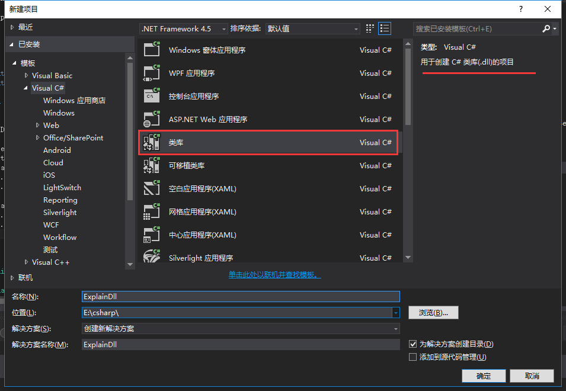
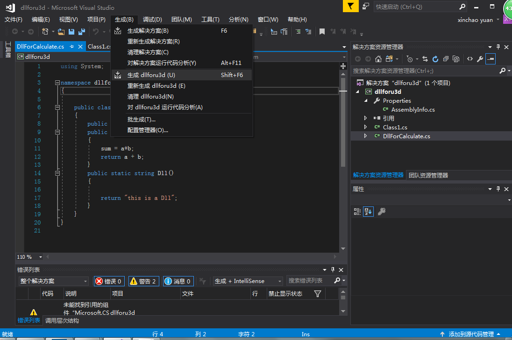
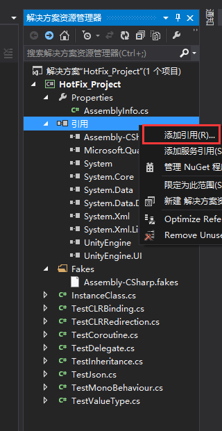

##生成dll
#### 方式1 ####
使用visual studio生成dll文件是十分简单的，将工程新建好(新建类库工程)  
  
后点击生成  
  
这时在工程文件夹下的bin/Debug目录下就会出现用整个工程生成的dll文件。将这个dll文件放入其他需要的工程中就可以使用了。

* 如果需要设置引用的话比如UnityEngine.dll，可以在解决方案框右击添加引用。如下图   
  

#### 方式2 ####
如果想要单独对一个文件生成dll，可以使用csc.exe命令，如果安装了visual studio的话 csc.exe 文件一般在vs的安装路径下一搜就能搜到。我的csc.exe在D:\Program Files\VisualStudio2017\MSBuild\15.0\Bin\Roslyn里。 这文件是微软基于.net的用于组建各式各样windows平台文件的命令(我猜的)。
参考：[https://msdn.microsoft.com/en-us/library/78f4aasd.aspx](https://msdn.microsoft.com/en-us/library/78f4aasd.aspx)
所以我最后使用的命令是    

	csc /target:library /r:Library\UnityAssemblies\UnityEngine.dll /out:Assets\Debuger.dll Assets\Debuger.cs  
上面命令的含义是生成target为library库(即dll)，reference的dll文件是unityengine.dll 输出路径是Assets\Debuger.dll，原文件在Assets\Debuger.cs

这里我是先把csc.exe 添加到了坏境变量里，然后cd到工程所在目录D:\Program Files\unity5prj\DebugLog 调用了这个命令。

最后竟然能正常使用，真是太棒了。  

mac平台应该是  

	mcs -r:/Applications/Unity/Unity.app/Contents/Frameworks/Managed/UnityEngine.dll -target:library ClassesForDLL.cs  
这个命令。参考[http://www.xuanyusong.com/archives/2782](http://www.xuanyusong.com/archives/2782)雨凇大大写的。