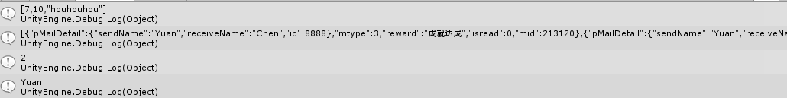

#### JsonNet 解析字符串
**核心API**  

* `JsonConvert.SerializeObject(Obj);`
* `JsonConvert.DeserializeObject<T>(jsonString);`

封装一层后为  

	public class Json  {
	    private static readonly ArrayList _arrayList = new ArrayList(32);
	    public static string ToJsonString(params object[] objs)
	    {
	        _arrayList.Clear();
	        for (int i = 0; i < objs.Length; ++i)
	        {
	            _arrayList.Add(objs[i]);
	        }
	        return JsonConvert.SerializeObject(_arrayList);
	    }
	    public static T ToObject<T>(string jsonString)
	    {
	        return JsonConvert.DeserializeObject<T>(jsonString);
	    }
	}

使用：  

    private int pic=7;
    private int udid=10;
    private string str = "houhouhou";
	void Start ()
	{
        P_Mail pMail  = new P_Mail();
	    pMail.mtype = 3;
	    pMail.isread = 0;
	    pMail.reward = "成就达成";
	    pMail.mid = 213120;
        pMail.pMailDetail = new P_MailDetail();
	    pMail.pMailDetail.sendName = "Yuan";
        pMail.pMailDetail.receiveName = "Chen";
        pMail.pMailDetail.id = 8888;
        Debug.Log(Json.ToJsonString(pic, udid, str));
        //这里打印结果为  [7,10,"houhouhou"]
        string jsonpMail = Json.ToJsonString(pMail, pMail);
        Debug.Log(jsonpMail);
        List<P_Mail> newPMailList = Json.ToObject<List<P_Mail>>(jsonpMail);
        Debug.Log(newPMailList.Count);
        Debug.Log(newPMailList[0].pMailDetail.sendName);
	}

对应类：

	class P_Mail
	{
	    public P_MailDetail pMailDetail;
	    public int mtype; //邮件类型模板id - 见MailType
	    public string reward; //邮件可领取的奖励
	    public int isread; //是否阅读过
	    public int mid; //邮件guid
	}
	class P_MailDetail
	{
	    public string sendName;
	    public string receiveName;
	    public int id = 8888;
	}

注意：
源码太特么多了，只说注意点吧  

* 需要解析的json字符串 应该是与类对应的，如果json字符有的字段对应类没有：略过。如果类里的变量json里没有：引用类型-null，值类型-默认值
* json中会用反射新建此类实例(猜测)