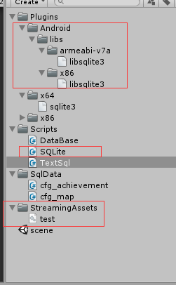
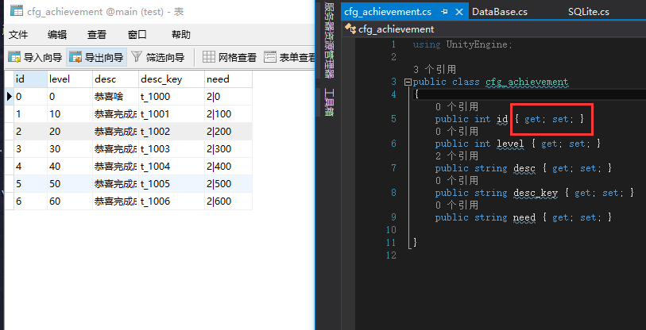

## 读取sqlite3数据库
GitHub大神多，unity读取sqlite3:[戳链接](https://github.com/codecoding/SQLite4Unity3d)  

下载demo运行一下，都ok的。  
栗子在这：  
除了git工程里的文件。这里又从公司的代码里扒下来一个**DataBase**文件，用于方便读写。具体放在代码文件夹里。SQLite文件是git大神写的。  
  

读取代码：  

    private static void DoInit()
    {
        DataBase.Connect();
        _data1 = DataBase.TableAsList<cfg_achievement>();
        _data2 = DataBase.TableAsDictionary<int, cfg_map>(v => v.id);
    }

注意以下几点：  

* db放在StreamingAssets里
* 类的命名要与数据库的对应
* 变量要用{get;set;}方法  (**重点重点重点**) 两次栽坑
* 这里要小写。(虽然大写的话在window平台不报错，但打包到Android平台时会读取不到，因为Android是基于Linux内核的操作系统，Linux环境下严格区分大小写的,这里踩过坑)