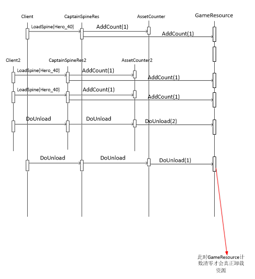

资源过大占用内存，不使用时卸载


```c#
public enum ResType
{
    Lock,           //不卸载
    RefCount,       //通过引用计数来卸载
}
```




在界面打开加载资源的时候，AssetCounter和GameResource 里各自的资源计数器都会增加。

当界面关闭的时候AssetCounter将自己计数减少的数量告诉GameResource，这样就算在嵌套引用，即Client和Client2同时引用的时候，GameResource也可以知道引用到底有没有为0。

如果没有AssetCounter这一层，那么Client2关闭的时候并不能确定要不要真正卸载资源。