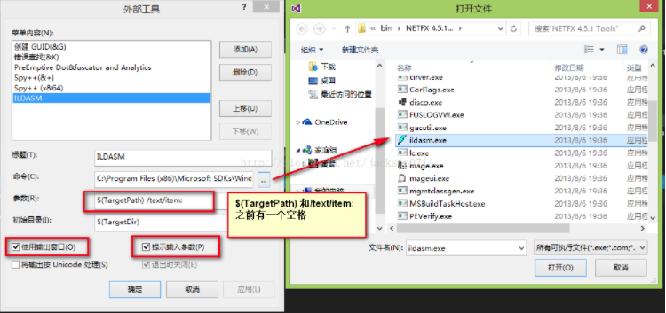

##ildasm配置
  
如果在vs的开始界面并没有默认的ildasm工具的话就需要自己配置。  

1.一般安装了vs的话都会在**c:\Program Files (x86)\Microsoft SDKs\Windows\v8.0A\bin\NETFX 4.0 Tools\**这个路径下找到**ildasm.exe**这个文件。 
 
2.2.VS2013->工具->外部工具  
  

3.添加工具ildasm.exe工具  
点击添加  
输入标题、命令、参数、初始目录  
勾选使用输出窗口、提示输入参数、退出时关闭  
参数： $(TargetPath) /text/item:  
初始目录:$(TargetDir)
  

4.点击ILDASM工具  
  
如果运行时不带参数的话打开的则是ildasm的默认窗口
  

