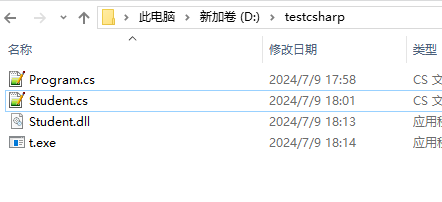
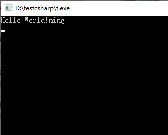

如何将cs文件编译成exe文件

代码**Program.cs**

```
using System;
using OtherNameSpace;
namespace ConsoleApp1
{
    class Program
    {
        static void Main(string[] args)
        {
            Student s = new Student();
            Console.WriteLine("Hello World!" + s.name);
            Console.ReadLine();
        }
    }
}
```

代码Student.cs

```
namespace OtherNameSpace
{
    public class Student
    {
        public string name = "ming";
    }
}
```

使用命令

```
csc /target:library /out:D:\testcsharp\Student.dll D:\testcsharp\Student.cs
```

将**Student.cs**编译成dll

使用命令

```
csc /r:System.dll /r:D:\testcsharp\Student.dll /out:D:\testcsharp\t.exe D:\testcsharp\Program.cs
```

将**Program.cs**编译成exe




执行exe可以看到



删除**Student.dll**执行文件exe会报错找不到dll。