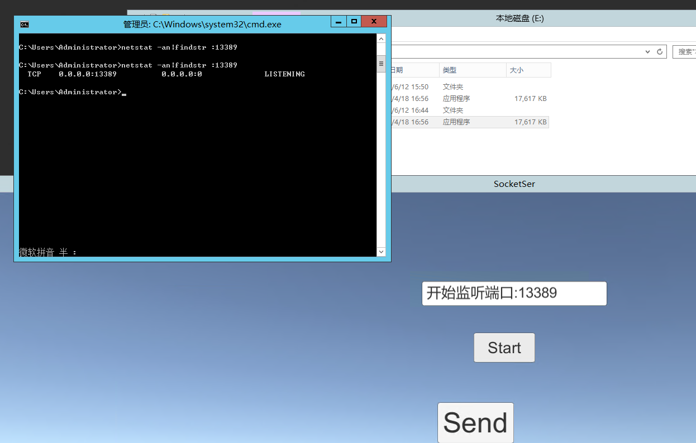

## Socket发布到服务器
在我将写好的socket通信的服务器端发布到阿里云服务器上的时候，发现并不能正常通信。  
百般纠结后发现是没有在阿里云的安全组里开放端口。(主要还是经验不足)  
戳这[VPC ECS实例公网访问控制](https://help.aliyun.com/document_detail/27732.html?spm=5176.doc25475.2.1.oNDXlL)  

##### 阿里云安全组
安全组是一个逻辑上的分组，是一种虚拟防火墙，是由同一个地域（Region）内具有相同安全保护需求并相互信任的实例组成，可用于设置单台或多台 ECS 实例的网络访问控制，是重要的网络安全隔离手段。每个实例至少属于一个安全组，在创建时就需要指定。同一安全组内的实例之间网络互通，不同安全组的实例之间默认内网不通。可以授权两个安全组之间互访。  

阿里默认安全组仅开放22,3389端口，所以在socket在进行端口通信的时候使用没有办法访问到服务器，也就不能通信。配置方法见上述链接。

#### netstat -an|findstr :3389 ####
windows下有个命令很好使`netstat -an|findstr :3389`后面数字放端口号，可以查看有什么程序监听了某个端口。如图:

