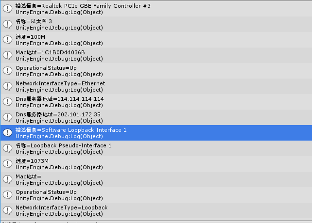
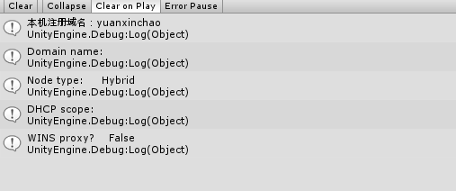

## 网络编程基础
#### 1.ip地址与端口
* ip地址识别到某台主机，端口识别到某个进程。
* 端口地址用两字节二进制表示，所以地址范围是0-FFFF(0-65536)。
* 1000以内的端口号大多被标准协议占用。所以程序中可以自由使用的端口号一般大于1000.
#### 2.IP地址转换相关类
######1) IPAddress
* 对ip处理和转换
>

	IPAddress ip = IPAddress.Parse("192.168.1.1");//ipv4
	IPAddress ip = IPAddress.Parse("：：1");//ipv6
	if(ip.AddressFamily ==AddressFamily.InterNetworkV6)//判断是否是ipv6

名称 |	说明
----|------|
Any	|提供了一个指示服务器必须侦听的所有网络接口上的客户端活动的 IP 地址。 此字段为只读。
Broadcast	|提供 IP 广播的地址。 此字段为只读。
IPv6Any	|Socket.Bind 方法使用 IPv6Any 字段指示 Socket 必须侦听的所有网络接口上的客户端活动。
IPv6Loopback	|提供 IP 环回地址。 此属性是只读的。
IPv6None	|提供了一个指示应使用任何网络接口的 IP 地址。 此属性是只读的。
Loopback	|提供 IP 环回地址。 此字段为只读。
None	|提供了一个指示应使用任何网络接口的 IP 地址。 此字段为只读。
######2) IPEndPoint
* 包含两部分地址名和端口号
>

    private const int port = 13389;
    private const string ip = "106.15.185.64"; 
	IPAddress ipAddress = IPAddress.Parse(ip);
    IPEndPoint remoteEP = new IPEndPoint(ipAddress, port);
######2) IPHostEntry 和 Dns
* 	获取本地计算机的主机名。
>
    string hostName = Dns.GetHostName();
    Debug.Log(hostName);
	//此处显示 yuanxinchao
	//本人Android机测试显示 localhost

*   主机名或 IP 地址解析为 IPHostEntry 实例。//域名解析为ip
>

	//下面获取百度服务器的所有IP地址
    IPHostEntry ipe = Dns.GetHostEntry("www.baidu.com");
    IPAddress[] ips = ipe.AddressList;
	//等效 IPAddress[] ips=Dns.GetAddresses("www.baidu.com");
    foreach (var ip in ips)
    {
        Debug.Log(ip.ToString());
    }
	//此处显示115.239.211.112 和115.239.210.27 通过这两个网址可以直接访问百度，但并是所有的网站都可以这样访问

#### 3.网卡和网络流量监测
* NetworkInterface 和 IPInterfaceProperties  //网卡,域名。。。
>

    NetworkInterface[] adapters = NetworkInterface.GetAllNetworkInterfaces();
    foreach (var adapter in adapters)
    {
        Debug.Log("描述信息=" + adapter.Description);
        Debug.Log("名称=" + adapter.Name);
        Debug.Log("速度=" + adapter.Speed/1000/1000 +"M");
        Debug.Log("Mac地址=" + adapter.GetPhysicalAddress());
        Debug.Log("OperationalStatus=" + adapter.OperationalStatus);
        Debug.Log("NetworkInterfaceType=" + adapter.NetworkInterfaceType);
        

        IPInterfaceProperties ip = adapter.GetIPProperties();
        if (ip == null)
        {
            Debug.Log("null ipinterfaceProterties");
        }
        else
        {
            foreach (var i in ip.DnsAddresses)
            {
                Debug.Log("Dns服务器地址=" + i);
            }
            
        }
    }
结果如下:  
  
 
* IPGlobalProperties 和 IPGlobalStatistics  //网络流量监测类
>

	//网络流量监测类
    IPGlobalProperties properties = IPGlobalProperties.GetIPGlobalProperties();
	//IPGlobalStatistics ipstat = properties.GetIPv4GlobalStatistics();
    Debug.Log("本机注册域名：" + properties.HostName);
	//Debug.Log("接受数据包数" + ipstat.ReceivedPackets);
	//Debug.Log("转发数据包数" + ipstat.ReceivedPacketsForwarded);
	//Debug.Log("传送数据包数" + ipstat.ReceivedPacketsDelivered);
	//Debug.Log("丢弃数据包数" + ipstat.ReceivedPacketsDiscarded);

    Debug.Log("Domain name:   "+properties.DomainName);
    Debug.Log("Node type:     "+properties.NodeType);
    Debug.Log("DHCP scope:    "+properties.DhcpScopeName);
    Debug.Log("WINS proxy?    "+properties.IsWinsProxy);
在unity中使用GetIPv4GlobalStatistics报错，所以注释掉了，打印结果如下:  
  