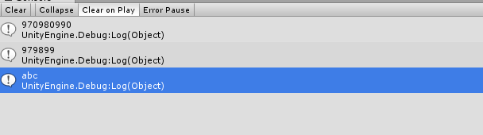

## 数据编码  
上代码：  

    string temp= string.Empty;
    string s1 = "abc";
    Encoding unicode = Encoding.Unicode;//unicode编码
    Encoding utf8 = Encoding.UTF8;//utf8编码
    byte[] b1 = unicode.GetBytes(s1);//用unicode将字符串编码为二进制
    foreach (var v in b1)
    {
        temp += v.ToString();
    }
    Debug.Log(temp);
    temp = string.Empty;
    byte[] b2 = Encoding.Convert(unicode, utf8, b1);//用unicode编码读取二进制，并用utf8编码为二进制
    foreach (var v in b2)
    {
        temp += v.ToString();
    }
    Debug.Log(temp);
    string s = utf8.GetString(b2);//将b2用utf8解码成字符串
    Debug.Log(s);

#### UTF8Encoding.GetString 的其他重载  

	[ComVisibleAttribute(false)]
	public override string GetString(
		byte[] bytes,
		int index,
		int count
	)
* bytes
Type: System.Byte[]
包含要解码的字节序列的字节数组。
* index
Type: System.Int32
第一个要解码的字节的索引。
* count
Type: System.Int32
要解码的字节数。