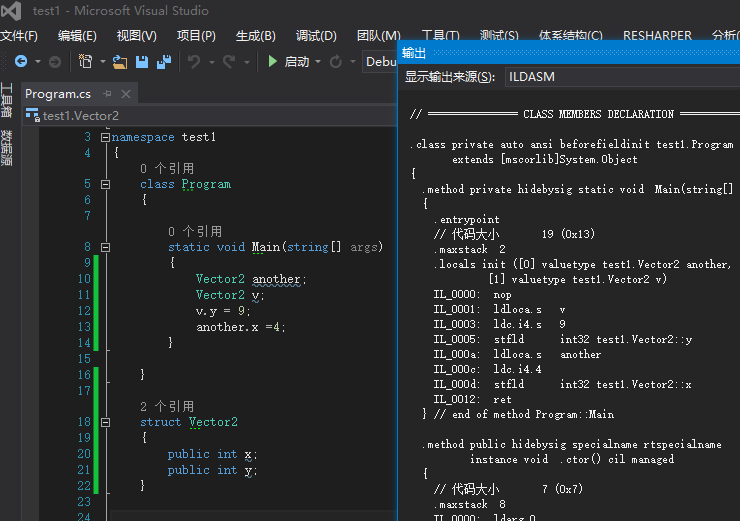

## C# -> IL
微软的C# F# VB等语言都是基于.NET平台的语言，这些语言编译时会生成一个中间语言，也就是Intermediate language，而.Net的跨平台就是讲IL语言转为Android iOS等对应平台的语言。那么，怎么查看c#生成中间语言呢。  
#### 配置ildasm
先配置好ildasm工具(详见**配置查看IL语言工具ildasm/ildasm配置.md**)  
#### 阅读iL代码
所有指令：[https://en.wikipedia.org/wiki/List_of_CIL_instructions](https://en.wikipedia.org/wiki/List_of_CIL_instructions)  
指令详解：[https://msdn.microsoft.com/zh-cn/library/system.reflection.emit.opcodes.stfld.aspx](https://msdn.microsoft.com/zh-cn/library/system.reflection.emit.opcodes.stfld.aspx)  
  