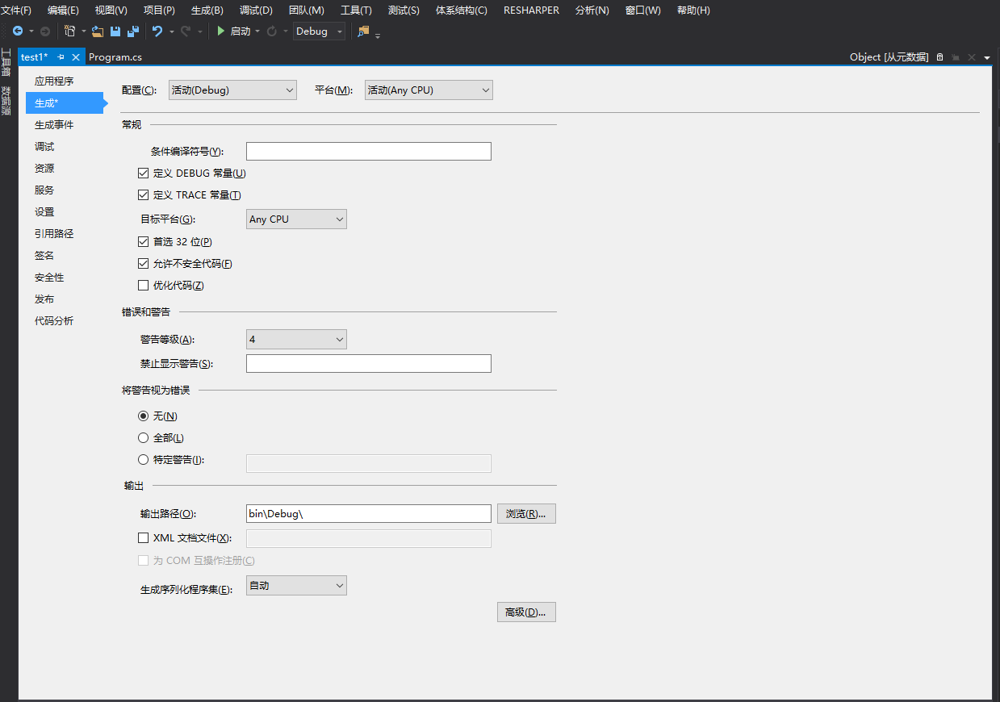

## C#指针
C#中也有指针。不过微软不推荐使用，想要使用的话加上unsafe 修饰，然后在vs勾选允许不安全代码的选项即可  
在 Visual Studio 开发环境中设置此编译器选项  
1.打开项目的“属性”页。

2.单击“生成”属性页。

3.选中“允许不安全代码”复选框。(记得保存)  
  
示例代码：  
    int number;

    unsafe 
    {
        // Assign the address of number to a pointer:
        int* p = &number;

        // Commenting the following statement will remove the
        // initialization of number.
        *p = 0xffff;

        // Print the value of *p:
        System.Console.WriteLine("Value at the location pointed to by p: {0:X}", *p);

        // Print the address stored in p:
        System.Console.WriteLine("The address stored in p: {0}", (int)p);
    }