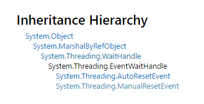

## Socket
先来个[基础教程](http://www.cnblogs.com/OpenCoder/archive/2011/12/29/2305528.html)  
当然还是[官网](https://msdn.microsoft.com/en-us/library/system.threading.eventwaithandle.aspx)的最好。  

#####1.继承层次

  
在.NET的System.Threading命名空间中有一个名叫WaitHandler的类，这是一个抽象类(abstract),我们无法手动去创建它，但是WaitHandler有三个子类，这三个子类分别是：System.Threading.EventWaitHandle，System.Threading.Mutex，System.Threading.Semaphore，这三个类都是非Abstract的，可以由开发者来创建和使用.其中本文主要讨论的是其中的System.Threading.EventWaitHandle类。  

EventWaitHandle类的用途是可以调用其WaitOne方法来阻塞线程的运行，直到得到一个信号（该信号由EventWaitHandle类的Set方法发出），然后释放线程让其不再阻塞继续运行。  

EventWaitHandle类拥有两种状态，终止状态 和 非终止状态：

* 在终止状态下，被WaitOne阻塞的线程会逐个得到释放，所以当EventWaitHandle始终处于终止状态时，调用其WaitOne方法无法起到阻塞线程的作用，因为线程被其WaitOne方法阻塞后，会立即被释放掉。
* 在非终止状态下，被WaitOne阻塞的线程会继续被阻塞，如果一个线程在EventWaitHandle对象处于非终止状态时调用了其WaitOne函数，该线程会立即被阻塞。  

需要注意的是终止状态和非终止状态之间，是可以相互转换的。调用EventWaitHandle对象的Set方法既可以将EventWaitHandle对象设置为终止状态，调用EventWaitHandle对象的Reset方法既可以将EventWaitHandle对象设置为非终止状态。

	public static ManualResetEvent allDone = new ManualResetEvent(false);
	allDone.Reset();
  	new Thread(DoSomething()).Start();
	allDone.WaitOne();

	DoSomething(){
		balabala.....
		allDone.Set();
	}

在这里虽然开起了线程，但是因为有`allDone.WaitOne();`的阻塞，所以主线程只能等待`DoSomething()`结束后终止阻塞才能继续运行。所以阻塞函数经常用于线程同步。  

另一种构造方式：  

	static EventWaitHandle eHandle = eHandle = new EventWaitHandle(true, EventResetMode.AutoReset);//eHandle初始为终止状态，模式为AutoReset  

更高端的用法请去官网。-。-