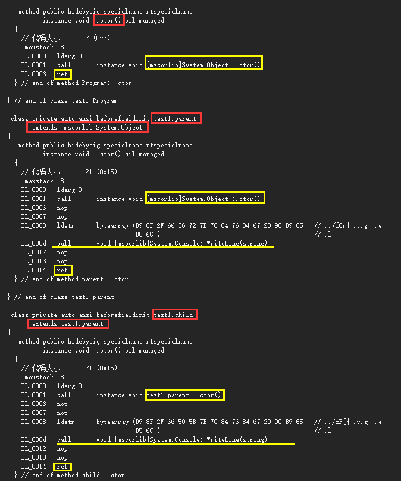

## 
看一段c#构造函数代码对应的的il代码  

    class Program
    {
        static void Main(string[] args)
        {
            child p = new child();
        }
    }
    class parent
    {
        public parent()
        {
            Console.WriteLine("这是父类的构造方法");
        }
    }
    class child : parent
    {
        public child()
        {
            Console.WriteLine("这是子类的构造方法");
        }
    }
先看输出结果:  
  
没有什么疑问，接下来是Main函数。  
  
* 可以看到新建child类后调用了child的构造函数
* stloc.0 则是将新建好的Obj从栈中弹到局部变量0中  
* 下面还有一个构造函数则是Program默认从Object中继承的。  
  

* 上面主函数中调用child的构造函数时，其实是向父级层层调用(见黄框)，然后执行完父级的构造函数(Console.WriteLine)后再层层返回(ret)。  
* ldarg.0 含义是加载参数0到栈上，这个参数存储的位置应该是类似于寄存器的东西。
* 如果构造函数里有其他参数则会再加载ldarg.1等，当调用函数时则会pop栈上的参数进行操作。
