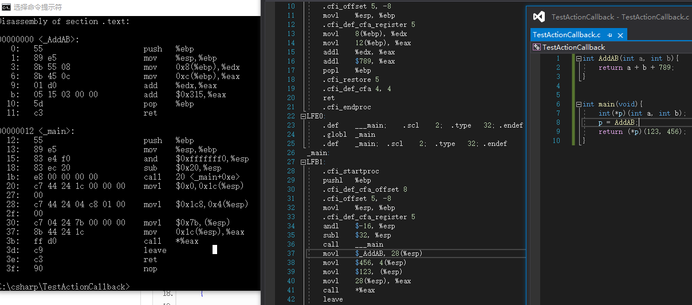

c语言中的函数指针实现

入口：

​	"程序内存"处有_AddAB的函数地址 ，加载存到"栈"里，使用时拷贝到"寄存器"，调用call函数

参数

​	将参数压入"栈"中(实际放到寄存器应该也可以)，

返回

​	将返回值压入%eax(返回值寄存器)。

值得注意的是：

​	调用call后 %esp 自减了8，所以"程序内存代码"里的AddAB里的8(%esp)指的是先前(%esp)里的123

