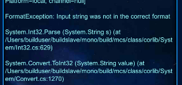

## 正则表达式

参考连接：https://github.com/ziishaned/learn-regex/blob/master/translations/README-cn.md

#### 1.各字符含义


栗子：  

* ^[0-9]+$   从开头^到结束$ 出现一次或多次+  ,0-9的 数字
* ()   标记一个子表达式的开始和结束位置
* ?  匹配前面的子表达式零次或一次，或指明一个非贪婪限定符  

#### 2.贪婪与非贪婪
`*、+和?限定符都是贪婪的，因为它们会尽可能多的匹配文字，只有在它们的后面加上一个?就可以实现非贪婪或最小匹配。`例如，您可能搜索 HTML 文档，以查找括在 H1 标记内的章节标题。该文本在您的文档中如下：
栗子：  
`<H1>Chapter 1 - 介绍正则表达式</H1>`  
**贪婪：**下面的表达式匹配从开始小于符号 (<) 到关闭 H1 标记的大于符号 (>) 之间的所有内容。`/<.*>/`  
**非贪婪：**如果您只需要匹配开始和结束 H1 标签，下面的非贪婪表达式只匹配` <H1>`。 `/<.*?>/`  

通过在 *、+ 或 ? 限定符之后放置 ?，该表达式从"贪心"表达式转换为"非贪心"表达式或者最小匹配。

#### 4.平衡组/递归匹配
有时我们需要匹配像 ( 100 * ( 50 + 15 ) ) 这样的可嵌套的层次性结构，这时简单地使用 \(.+\)则只会匹配到最左边的左括号和最右边的右括号之间的内容.假如原来的字符串里的左括号和右括号出现的次数不相等，比如 ( 5 / ( 3 + 2 ) ) )，那我们的匹配结果里两者的个数也不会相等。有没有办法在这样的字符串里匹配到最长的，配对的括号之间的内容呢？
#### 3.C#中的使用
1.新建一个模式为单行，非贪婪的正则表达式：
`Regex RegexKey = new Regex(@"(你好)(\d+)(\S+)", RegexOptions.Singleline);`
2.和一个字符串msg进行匹配：  

	string msg = "aa你好123456dsad bb你好654321hello";
	MatchCollection mc = RegexKey.Matches(msg);  
3.获取匹配结果：

    for (int i = 0; i < mc.Count; i++)
    {
        var m = mc[i];
        Console.WriteLine("m.Index= " + m.Index); 
        Console.WriteLine("m.Value= " + m.Value);
        Console.WriteLine("m.Groups[0].Value= " + m.Groups[0].Value);
        Console.WriteLine("m.Groups[1].Value= " + m.Groups[1].Value);
        Console.WriteLine("m.Groups[2].Value= " + m.Groups[2].Value);
    }
    Console.WriteLine("origin= "+msg);
这里获取的匹配结果里的match属性有，匹配字串的index，长度length等。`m.Value`和`m.Groups[0].Value`一样都是对应这个正则的匹配，而`m.Groups[1].Value`和`m.Groups[2].Value`等等，则是对应第一和第二 **()**里匹配的内容，往后类推。结果如图：  


---
正则坑1：  
要个需求是对坐标加颜色并且获取坐标值，所以要匹配坐标。  
正则表达式写为：

	private static readonly Regex s_CoordRegex =
	    new Regex(@"(\[)?([\d]{1,4})[,\.\uff0c\u3001]([\d]{1,4})(\])?", RegexOptions.Singleline);  
\d 是匹配数字，表面看来好像并无问题，但是在执行如下代码  

	foreach (Match match in s_CoordRegex.Matches(outputText))
	{
	        var x = Convert.ToInt32(match.Groups[2].Value);
	        var y = Convert.ToInt32(match.Groups[3].Value);
			...
	}
有时会报错，  
  
诶？为什么Input string的format不对呢，这是因为对于\d的匹配不仅会匹配到0-9(半角)也会匹配到０-９(全角)，注意两个是不一样的。在GBK码表现为为**0-9(半角)->30-39(16进制)**，**０-９(全角)->A3B0-A3B9** 。在Unicode码表现为**(半角0-9)->(\u0030-\u0039)**,**(全角０-９)->(\uff10-\uff19)**，哎呀，不管什么码，就是全角格式的０-９啦，  
**然后**，如果是有个全角坐标如１２，３４ Convert时就会报格式错。  
解决方案1：将全角替换为半角

    public static string ToDBC(string input)
    {
        char[] c = input.ToCharArray();
        for (int i = 0; i < c.Length; i++)
        {
            if (c[i] >= 65248 + 48 && c[i] < 65248 + 57)
                c[i] = (char)(c[i] - 65248);
        }
        return new string(c);
    }
解决方案2：正则只匹配半角0-9，如下代码

	private static readonly Regex s_CoordRegex =
	    new Regex(@"(\[)?([\u0030-\u0039]{1,4})[,\.\uff0c\u3001]([\u0030-\u0039]{1,4})(\])?", RegexOptions.Singleline);
	最好方案为
	private static readonly Regex s_CoordRegex =
	    new Regex(@"(\[)?([0-9]{1,4})[,\.\uff0c\u3001]([0-9]{1,4})(\])?", RegexOptions.Singleline);
	//注意上面是半角0-9  

#### 5.(?:pattern) 模式  
[参考](http://www.imkevinyang.com/2009/08/%E4%BD%BF%E7%94%A8%E6%AD%A3%E5%88%99%E8%A1%A8%E8%BE%BE%E5%BC%8F%E6%89%BE%E5%87%BA%E4%B8%8D%E5%8C%85%E5%90%AB%E7%89%B9%E5%AE%9A%E5%AD%97%E7%AC%A6%E4%B8%B2%E7%9A%84%E6%9D%A1%E7%9B%AE.html)  
首先解释下，不然不容易理解。  
正则表达式中有前瞻(Lookahead)和后顾(Lookbehind)的概念，这两个术语非常形象的描述了正则引擎的匹配行为。需要注意一点，正则表达式中的前和我们一般理解的前后有点不同。一段文本，我们一般习惯把文本头部向尾部开头的方向称作"前面"，文本末尾方向称为"后面"。但是**对于正则表达式引擎来说，因为它是从文本头部向文本尾部开始解析的(可以通过正则选项控制解析方向)，因此对于文本尾部方向，称为"前"，因为这个时候，正则引擎还没走到那块，而对文本头部方向，则称为"后"，因为正则引擎已经走过了那一块地方**。如下图所示：  
  
所谓的前瞻就是在正则表达式匹配到某个字符的时候，往"尚未解析的文本"预先看一下，看是不是符合/不符合匹配模式，而后顾，就是在正则引擎已经匹配过的文本看看是不是符合/不符合匹配模式。符合和不符合特定匹配模式我们由称为**肯定式匹配和否定式匹配**。


**pattern 模式共同点**：不会保存()里的匹配结果。即不会放到m.Groups[x].Value里面。因为这些模式只是判定是否符合预查条件的。  

**(?:pattern)**:  
regex: `@"industr(?:y|ies)"`  
目标字串: he have a industry,they have industries.   
结果:industry 和 industries

**(?=pattern)**  
前瞻模式  
栗子：  
regex: `@"(?=cs).*"`  
目标字串: adwdcsdiudiu  
逻辑：  前瞻是否有符合(?=cs)的文本，有，则将接下来的文本(包括字串cs)对.*进行匹配,无，则继续推进。  
结果: csdiudiu

**(?!pattern)**  
前瞻模式  
栗子：  
regex： `(?!th)\w+\b`  
目标字串: then  
结果: hen

**(?<=pattern)**  
**后顾模式**  
栗子：  
regex： `@"(?<=\d\d)\wWindow"`  
目标字串： s1aNTbWindows2000aWindows22ds
逻辑:匹配到一个字符(\w)连着Window字串时，后顾一下，符合\d\d 即两个数字连一起的就匹配出来。  
结果:aWindow

**(?<!pattern)**  
**顾后模式**  
栗子：  
regex： `@"(?<!\d\d)\wWindow"`  
目标字串： s1aNTbWindows2000aWindows22ds  
结果:bWindows


```
private static Regex RegexKey = new Regex(@"^#[a-zA-Z0-9]{8}$", RegexOptions.Singleline);
```

