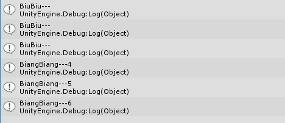
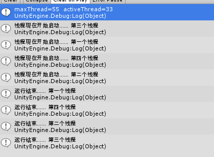
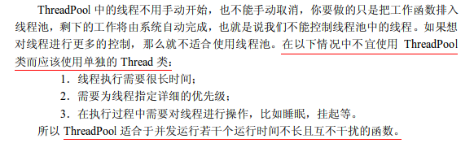
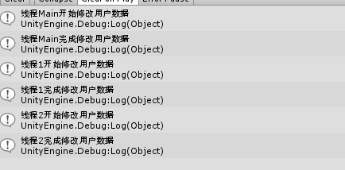
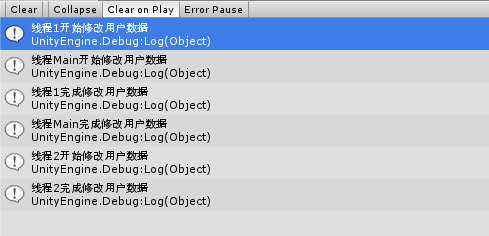

## 多线程
深度好文：[C#多线程](http://www.cnblogs.com/dotnet261010/p/6159984.html)
#### 1.基本概念
进程(Process)是windows系统中的一个基本概念，它包含着一个运行程序所需要的资源。一个正在运行的应用程序在操作系统中被视为一个进程，进程可以一个或多个线程，线程是操作系统分配处理器时间的基本单元。在进程中可以有多个线程同事执行代码。进城之间是相对独立的，一个进程无法访问另一个进程的数据（除非利用分布式计算方式），一个进程运行的失败也不会影响其他进程的运行，Windows系统就是利用进程把工作划分为多个独立的区域的。进程可以理解为一个程序的基本边界。是应用程序的一个运行例程，是应用程序的一次动态执行过程。  
线程（Thread）是进程中的基本执行单元，是操作系统分配CPU时间的基本单位，一个进程可以包含若干个线程，在进程入口执行的第一个线程被视为这个进程的主线程。在.NET应用程序中，都是以Main()方法作为入口的，当调用此方法时系统就会自动创建一个主线程。线程主要是由CPU寄存器、调用栈和线程本地存储器（Thread Local Storage，TLS）组成的。CPU寄存器主要记录当前所执行线程的状态，调用栈主要用于维护线程所调用到的内存与数据，TLS主要用于存放线程的状态信息。
#### 2、多线程
多线程的优点：可以同时完成多个任务；可以使程序的响应速度更快；可以让占用大量处理时间的任务或当前没有进行处理的任务定期将处理时间让给别的任务；可以随时停止任务；可以设置每个任务的优先级以优化程序性能。

然而，多线程虽然有很多优点，但是也必须认识到多线程可能存在影响系统性能的不利方面，才能正确使用线程。不利方面主要有如下几点：

* 1.线程也是程序，所以线程需要占用内存，线程越多，占用内存也越多。
 
* 2.多线程需要协调和管理，所以需要占用CPU时间以便跟踪线程。
 
* 3.线程之间对共享资源的访问会相互影响，必须解决争用共享资源的问题。
 
* 4.线程太多会导致控制太复杂，最终可能造成很多程序缺陷。

当启动一个可执行程序时，将创建一个主线程。在默认的情况下，C#程序具有一个线程，此线程执行程序中以Main方法开始和结束的代码，Main（）方法直接或间接执行的每一个命令都有默认线程（主线程）执行，当Main（）方法返回时此线程也将终止。

#### 3.使用步骤
创建多线程的步骤：
1、编写线程所要执行的方法
2、实例化Thread类，并传入一个指向线程所要执行方法的委托。（这时线程已经产生，但还没有运行）
3、调用Thread实例的Start方法，标记该线程可以被CPU执行了，但具体执行时间由CPU决定

#### 4.用法  
名称 | 说明 
----|------
[Thread(ParameterizedThreadStart)](https://msdn.microsoft.com/zh-cn/library/1h2f2459(v=vs.95).aspx)| 初始化 Thread 类的新实例，指定允许对象在线程启动时传递给线程的委托。要执行的方法是有参的。  
[Thread(ThreadStart)](https://msdn.microsoft.com/zh-cn/library/xx3ezzs2(v=vs.95).aspx) | 初始化 Thread 类的新实例。要执行的方法是无参的。 
#### 5.示例

	void Start ()
	{
        Thread thread1 = new Thread(new ThreadStart(Biubiu));
        Thread thread2 = new Thread(Biubiu);
        Thread thread3 = new Thread(() => Debug.Log("BiuBiu---"));
        thread1.Start();
        thread2.Start();
        thread3.Start();

        Thread thread4 = new Thread(new ParameterizedThreadStart(BiangBiang));
        Thread thread5 = new Thread(BiangBiang);
        Thread thread6 = new Thread((num) => Debug.Log("BiangBiang---"+num));
        thread4.Start(4);
        thread5.Start(5);
        thread6.Start(6);
	}

    void Biubiu()
    {
        Debug.Log("BiuBiu---");
    }

    void BiangBiang(object num)
    {
        Debug.Log("BiangBiang---"+num);
    }
结果如下：  

#### 6.线程的常用属性
属性名称|说明
----|------
CurrentContext|	获取线程正在其中执行的当前上下文。
CurrentThread|	获取当前正在运行的线程。
ExecutionContext|	获取一个 ExecutionContext 对象，该对象包含有关当前线程的各种上下文的信息。
IsAlive|	获取一个值，该值指示当前线程的执行状态。
IsBackground|	获取或设置一个值，该值指示某个线程是否为后台线程。
IsThreadPoolThread|	获取一个值，该值指示线程是否属于托管线程池。
ManagedThreadId|	获取当前托管线程的唯一标识符。
Name|	获取或设置线程的名称。
Priority|	获取或设置一个值，该值指示线程的调度优先级。
ThreadState|	获取一个值，该值包含当前线程的状态。

小栗子：  

	//获取正在运行的线程
	Thread thread = Thread.CurrentThread;
	//thread.Name = "主线程";
	//获取当前线程的唯一标识符
	int id = thread.ManagedThreadId;
	//获取当前线程的状态
	ThreadState state= thread.ThreadState;
	//获取当前线程的优先级
	ThreadPriority priority= (ThreadPriority) thread.Priority;
	string strMsg = string.Format("Thread ID:{0}\n" + "Thread Name:{1}\n" +
	    "Thread State:{2}\n" + "Thread Priority:{3}\n", id, thread.Name,
	    state, priority);
	Debug.Log(strMsg);  

#### 7.前台线程和后台线程
一个线程要么是前台线程，要么是后台线程。只有当属于某个进程的所有前台线程都终止后，公共语言运行库才会结束该线程，而且所有属于该进程的后台线程也都会立即停止。
#### 8.线程池ThreadPool
* 省心省资源，不可控顺序和挂起和停止，不适合长时间执行的线程
* 托管到线程池中的线程都是后台线程
* 添加到线程池中的任务不一定会立即执行，顺序也无法保证。
* 线程池可以自动重用已创建的线程。即线程完成后返回到等待队列等待重用而不是销毁。
* 一个进程共享一个线程池

上代码：

	void Start ()
	{
        System.Threading.WaitCallback waitCallback = new WaitCallback(MyThreadWork);
	    int maxThread;
	    int activeThread;
        ThreadPool.SetMaxThreads(55, 33);
	    ThreadPool.GetAvailableThreads(out maxThread, out activeThread);
	   
        Debug.Log("maxThread="+maxThread+"  activeThread="+activeThread);
        ThreadPool.QueueUserWorkItem(waitCallback, "第一个线程");
        ThreadPool.QueueUserWorkItem(waitCallback, "第二个线程");
        ThreadPool.QueueUserWorkItem(waitCallback, "第三个线程");
        ThreadPool.QueueUserWorkItem(waitCallback, "第四个线程");
	}

    public static void MyThreadWork(object state)
    {
        Debug.Log(string.Format("线程现在开始启动…… {0}", (string)state));
        Thread.Sleep(1000);
        Debug.Log(string.Format("运行结束…… {0}", (string)state));
    }
上结果：  
  

* 有默认的  最大线程数(池子里可以堆的线程数)和可以同时活动线程数。
* ThreadPool.SetMaxThreads(55, 33);不能设置的最大工作线程或 I/O 完成线程数为一个数字小于在计算机上的处理器数。(所以不太可能让线程池里的线程一个一个运行。)
* 可能你也注意到了，顺序不固定
* 在unity里有些api不能用，有可能是选中了Net 2.0subset，Net 2.0范围大一点。
###### 什么时候用ThreadPool

#### 9.volatile 和 Lock
#####volatile  

多个线程同时访问一个变量，CLR为了效率，允许每个线程进行本地缓存，这就导致了变量的不一致性。volatile就是为了解决这个问题，volatile修饰的变量，不允许线程进行本地缓存，每个线程的读写都是直接操作在共享内存上，这就保证了变量始终具有一致性。

* **告诉编译器不要去优化** `int a = 1;if(a == 1){ dosomething();}`编译器优化后，程序执行时并不会再去取a的值，但是其他线程有可能改变a的值，所以这里可以加上volatile。
* **从内存读，而不是缓存。**
在多线程程序中，如果把一个变量放入Cache后，又有其他线程改变了变量的值，那么本线程是无法知道这个变化的。它可能会直接读Cache里的数据。但是很不幸，Cache里的数据已经过期了，读出来的是不合时宜的脏数据。这时就会出现bug。
用Volatile声明变量可以解决这个问题。用Volatile声明的变量就相当于告诉编译器，我不要把这个变量写Cache，因为这个变量是可能发生改变的  

##### Lock 
参考[官网](https://msdn.microsoft.com/zh-cn/library/c5kehkcz(VS.80).aspx)   
lock(objectA){codeB} 看似简单，实际上有三个意思，这对于适当地使用它至关重要：

* 1. objectA被lock了吗？没有则由我来lock，否则一直等待，直至objectA被释放。
* 2. 由1，lock以后在执行codeB的期间其他线程不能调用codeB。
* 3. 执行完codeB之后释放objectA，并且codeB可以被其他线程访问。

**lock(obj)其实并不是将obj锁住，而是利用obj作为这块代码临界区的标识。**(obj在此期间爱干嘛干嘛,)**不管obj是静态或者实例对象，都遵从以上原则不变**(最佳做法是定义 private 对象来锁定, 或 private static 对象变量来保护所有实例所共有的数据。)

代码：
  
	private Object _lock = new Object();
    private playerData pd = new playerData(110,340,344100);
	void Start()
    {
        Thread td1 = new Thread(ChangeValue);
        td1.Start(1);
        ChangeValue("Main");
        Thread td2 = new Thread(ChangeValue);
        td2.Start(2);
    }

    void ChangeValue(object threadNo)
    {
        lock (_lock)
        {
            Debug.Log("线程" + threadNo + "开始修改用户数据");
            Thread.Sleep(1000);
            pd.lv = 50;
            Debug.Log("线程" + threadNo + "完成修改用户数据");
        }
    }
加锁结果：  
  
不加锁结果:  
