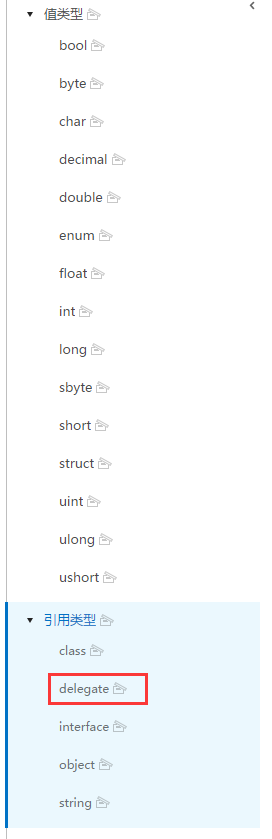

## delegate
#### 使用 ####
委托其实就是把方法作为变量一样去赋值，引用，和执行。

    public delegate void EventHandel<T>(T str);
    private EventHandel<string> _printXxx;
	// Use this for initialization
	void Start ()
	{
		_printXxx =delegate(string str) { Debug.Log("CCCC---" + str); };
        _printXxx = new EventHandel<string>(this.PrintA);
        //_printXxx = PrintA;
        _printXxx = (EventHandel<string>)Delegate.Combine( _printXxx,new EventHandel<string>(this.PrintB));
        // _printXxx += PrintB;
        _printXxx("hehe");
	}
    void PrintA(string str)
    {
        Debug.Log("AAAA---" + str);
    }
    void PrintB(string str)
    {
        Debug.Log("BBBB---" + str);
    }

没有泛型可能会清晰一些，如上所示delegate类里重载了 =，+= 运算符，至于delegate类的源码还未找到。

##### 匿名委托/匿名方法
如上述：`_printXxx =delegate(string str) { Debug.Log("CCCC---" + str); };` 即匿名委托，也叫匿名方法(不存引用，不去声明，只用一次的方法)。  
可以在c#官方文档里找到这个基本类型(引用类型)  
