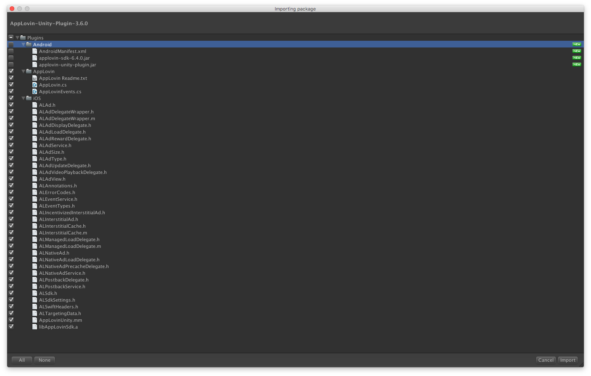
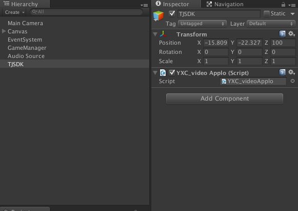

###Applovin广告
最近游戏要接applovin的广告，这里顺便记一下流程。
applovin的unity版SDK是十分好接的。这里我用的是
>**AppLovin-Unity-Plugin-3.6.0.unitypackage**

---
首先导入unity包

我们把android版的取消勾选。
点击import导入。
>1.先设置key
>
>		AppLovin.SetSdkKey("Aprxv6MDpRtG1gNRAO-2Xz4dp_XGmbqxPftInDVZeNqg2C7Cb5E72JlsJH73ty_HbsZM34xiRlNUxUgWawecEO");
>这里的key对应于你账号的  
>
>2.初始化
>
>		AppLovin.InitializeSdk();
>3.设置监听回调的gameobject
>
>		AppLovin.SetUnityAdListener ("TJSDK");
>
>
>如图这里的TJSDK是Hierarchy视窗的一个GameObject的名字，可以任意命名，需要保证的是TJSDK物体挂的脚本中有`public void onAppLovinEventReceived (string ev)`方法才能完成监听。因为applovin回调机制是在ios端使用`UnitySendMessage`方法发送至unity的Gameobject(TJSDK)的public方法(onAppLovinEventReceived)里且方法名为`onAppLovinEventReceived `(固定)。
>
>4.设置回调的监听
>  
>		public void onAppLovinEventReceived (string ev)
	{
		if (ev.Contains ("REWARDAPPROVEDINFO")) {
		// The format would be "REWARDAPPROVEDINFO|AMOUNT|CURRENCY" so "REWARDAPPROVEDINFO|10|Coins" for example
		} else if (ev.Contains ("LOADEDREWARDED")) {
			// A rewarded video was successfully loaded.
		} else if (ev.Contains ("LOADREWARDEDFAILED")) {
			// A rewarded video failed to load.
			Debug.Log ("load applovin fail go to load again");
		} else if (ev.Contains ("HIDDENREWARDED")) {
			// A rewarded video was closed.  Preload the next rewarded video.
		}
	}
>这里如果要求不高的话可以在HIDDENREWARDED(用户播放完成关闭视频)的时候给予玩家奖励。还有一点是REWARDAPPROVEDINFO是在用户点击播放时就会回调，这里踩过坑给大家提个醒。😊
>
>5.获取奖励视频  
>
>		AppLovin.LoadRewardedInterstitial ();
>6.判断奖励视频有没有加载好
>
>		AppLovin.IsIncentInterstitialReady ()
>7.播放奖励视频
>
>		AppLovin.ShowRewardedInterstitial ()
>至此对于奖励视频(激励视频)的处理已经完成。如果还需要对非激励视频作处理可以参考[applovin官网](https://www.applovin.com/integration#iOSUnityPlacements)的说明  
>另外附上[我的代码](./SDK/YXC_videoApplo.cs)

对了，还要在Xcode里添加依赖库
>Link the Following Frameworks in Your Project
>
>-  AdSupport
- AVFoundation
- CoreGraphics
- CoreMedia
- CoreTelephony
- StoreKit (NEW)
- SystemConfiguration
- UIKit
- WebKit (OPTIONAL)  

>⚠️在Other flag link里添加-ObjC