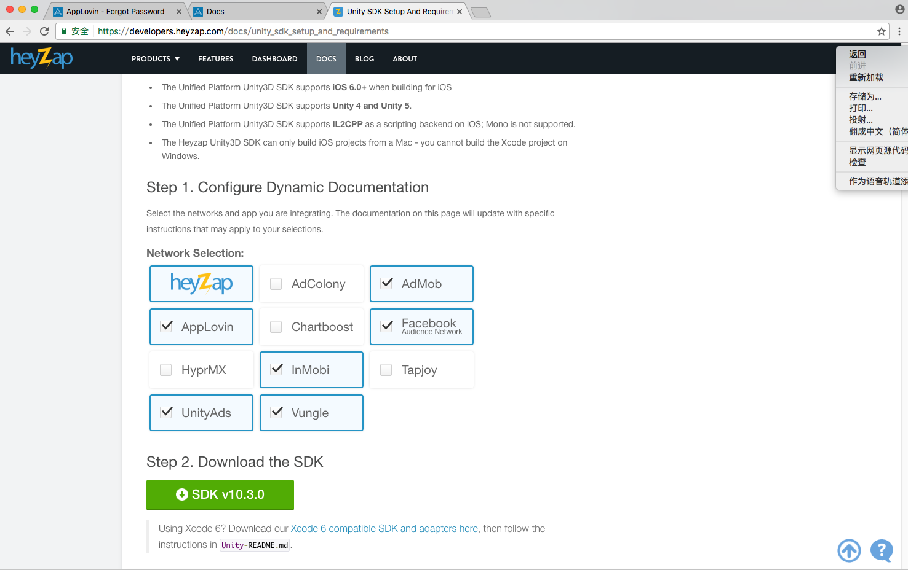
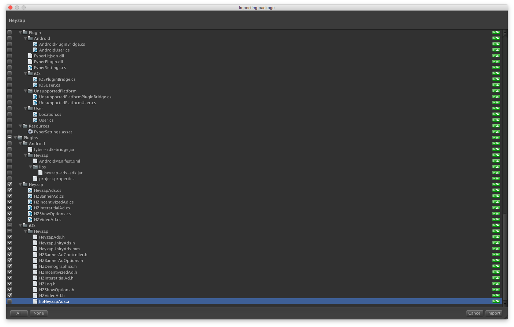
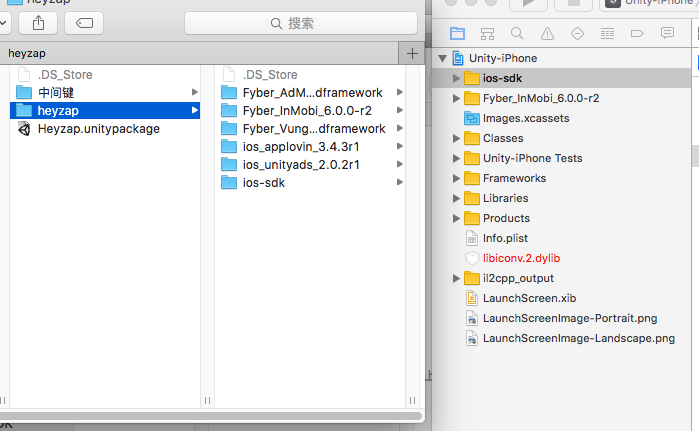

###Heyzap广告
heyzap是一家广告聚合平台，接入不难。难的是后台的配置，特别是填写payment那叫一个蛋疼。这里假设你后台都设置好了😂。
>我接入heyzap的方式是unity只导入他的中间键，然后在打包出的xcode工程里拖入他家本身的SDK和第三方SDK。 
>
 
---
>1.先去下载[unitypackage](https://developers.heyzap.com/docs/unity_sdk_setup_and_requirements).  
    
  
绿色的就是。
>2.导入unitypackage  

这里我只勾选了Plugins->Heyzap和Plugins->iOS－>Heyzap文件夹  
注意⚠️：这里把`libHeyzapAds.a`取消勾选。(因为一会会在Xcode端导入ios版的依赖)
>为什么只勾选这几个，我在这里啰嗦一下。首先，android的我不需要，其次，Editor下面与自动打包的相关的我不需要(因为我选择手动配置)。最后，因为不用自动打包所以里面的framework文件不会被导到xcode里，所以也不用导入。    

这样就保证了unity端与xcode端的交互。(小于unity5.0的版本记得把Heyzap文件夹下的.m和.h文件拖到iOS文件夹下)  
>3.初始化  
`HeyzapAds.Start ("your Publisher ID", HeyzapAds.FLAG_NO_OPTIONS);`  

一个Heyzap账号下所有应用共用同一个Publisher ID，他会自动区分应用，你要做的只是申请应用就行了。
>4.初始化banner
`HZBannerAd.ShowWithOptions (null);`  

参数暂时选空，其他参数可以去`HZBannerShowOptions`脚本查看具体设置。
>5.设置回调  
>banner回调：  
>`HZBannerAd.SetDisplayListener (ReceiveHZBannerCB);`
>vedio回调：
>`HZIncentivizedAd.SetDisplayListener (ReceiveVideoCB);`  

ReceiveHZBannerCB和ReceiveVideoCB为用户自己定义的方法(参数有要求，可参考本文结尾代码)  
>6.展示与隐藏banner  
>`HZBannerAd.ShowWithOptions (null);`
>`HZBannerAd.Hide ();`

这里展示的方法和初始化是一样的，但是调用到xcode的.mm文件时会进行区分，有兴趣的同学可以去看一下。
>7.展示视频与插屏  
>`HZIncentivizedAd.Show ();`
>`HZInterstitialAd.Show ();`

Incentivized为激励视频，Interstitial为插入视频，有静态和动态的区别。

>8.获取视频与插屏  
>`HZIncentivizedAd.Fetch ();`
>`HZInterstitialAd.Fetch ();`

割－－－－－
>9.判断视频和插屏是否加载好  
>`HZIncentivizedAd.IsAvailable ()`
>`HZInterstitialAd.IsAvailable ()`

嗯～大概就这么多，参考最后我附上的<a href="#tips1">代码</a>啦。  
####Xcode端
假如你在unity端的调用都写好了，Build之后还需要在Xcode端配置一下。下载对应的iOS版SDK，把你需要的第三方文件还有他家自己的SDK拖到你的工程里，选项为copy。  

注意⚠️：ios-sdk是他家自己的 必拖。其他的为第三方的  
搞定了，可以运行试试啦。相信你不会这么一帆风顺😏。
#####<a id="tips1">最后附上参考代码:</a>  
		using UnityEngine;
		using System.Collections;
		using Heyzap;
		using System.Collections.Generic;
		using System;
		using Umeng;
		public class YXC_video : MonoBehaviour
		{

	static Action finishtodo = null;
	public static bool showBanner = false;
	// Use this for initialization
	void Start ()
	{
		//*************初始化统计部分************//
		YXC_analyze.AnalyzeInit (Myparameters.Umeng_key, Myparameters.Channel_Id);
	
		//*************初始化heyzap视频banner************//
		HeyzapAds.Start (Myparameters.Heyzap_key, HeyzapAds.FLAG_NO_OPTIONS);
		HZIncentivizedAd.SetDisplayListener (ReceiveVideoCB);
		HZBannerAd.ShowWithOptions (null);//初始化banner
		HZBannerAd.SetDisplayListener (ReceiveHZBannerCB);
		GetIncentivizedVideo ();

	}
	#region  展示banner 视屏 插屏
	public static void PlayBanner (bool show)
	{
		showBanner = show;
		if (show) {
			HZBannerAd.ShowWithOptions (null);
		} else {
			HZBannerAd.Hide ();
		}
		//		AdsYuMiBannerUnity.setAdsYuMiViewHidden (!show);
	}

	public static void ShowVideo (Action ac=null)
	{
	
		if (ac != null) {
			finishtodo = ac;
		}
		
		Debug.Log ("heyzap video show");
		HZIncentivizedAd.Show ();
	}

	public static void ShowInterstitial ()
	{
		HZInterstitialAd.Show ();
	}

	#endregion

	void ReceiveVideoCB (string state, string tag)
	{

		if (state.Equals ("incentivized_result_complete")) {

			YXC_analyze.Events ("CompletedPlayVIDEO");
			Debug.Log ("heyazp视频播放完成，现在取下次视频");
			Debug.Log ("tag=" + tag);
			finishtodo ();
			HZIncentivizedAd.Fetch ();
		}
		if (state.Equals ("fetch_failed")) {
			Debug.Log ("heyazp视频获取失败，现在再去取视频");
			Debug.Log ("tag=" + tag);
			HZIncentivizedAd.Fetch ();
		}

		if (state.Equals ("available")) {
			Debug.Log ("heyazp视频获取成功");
			Debug.Log ("tag=" + tag);

		}
	}
	void ReceiveHZBannerCB (string state, string tag)
	{
		if (state.Equals ("loaded")) {
			Debug.Log ("bannerjiajiahao");
			PlayBanner (showBanner);
		}
		
	}
	#region 获取视频和插屏
	public static void GetIncentivizedVideo ()
	{
		HZIncentivizedAd.Fetch ();
		Debug.Log ("HeyzapAds.Fetch");
		
	}
	public static void GetInterstitial ()
	{
		HZInterstitialAd.Fetch ();
	}
	#endregion
	#region 判断视频和插屏是否加载好
	public static bool IsIncentivizedAvailable ()
	{
		
		if (HZIncentivizedAd.IsAvailable ()) 
			return true;
		else {
			Debug.Log ("heyzap video is no ready");
			GetIncentivizedVideo ();
		}
		
		return false;
	}
	public static bool IsInterstitialAvailable ()
	{
		if (HZInterstitialAd.IsAvailable ())
			return true;
		else {
			
			GetInterstitial ();
			return false;
		}
	}
	#endregion
}
