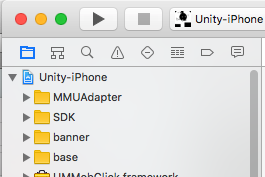

## 阿里妈妈AFP广告 之banner(iOS)
##### AFP广告banner条的接入  
阿里妈妈的广告由先前的芒果广告衍生而来，这里仅介绍一下接入方法。  
#### 1.先去[后台](http://afp.alimama.com/)申请推广位Id；⚠️：一个id对应一个包名。不能共用。记得还需要在APP推广位进行设置  
#### 2.在unity端写好调用。 
因为AFP仅提供iOS版和android版的SDK，所以unity和iOS间的交互需要自己完成。
  
	using UnityEngine;
	using System.Runtime.InteropServices;
	using System;
	using System.Collections.Generic;
	
	public class AliCallAct
	{
		public static void Init (string key)
		{
			#if UNITY_IPHONE
			Debug.Log ("YXC" + "  Call iOS init key=" + key [0]);
			InitAlimamaiOS (key);
			#endif
		}
	
		public static void ShowBanner (bool bo)
		{
			#if UNITY_IPHONE
			Debug.Log ("YXC" + "  Call iOS show  show=" + bo);
			ShowAliBanner (bo);
			#endif
		}
		[DllImport("__Internal")]
		static extern void InitAlimamaiOS (string aliKey);
		[DllImport("__Internal")]
		static extern void ShowAliBanner (bool bo);
	}
#### 3.在iOS放入导入需要的文件
  
如图这里有阿里原生的依赖文件**base**，因为我们要接入banner还需要导入**banner文件**。  
这样就集成了阿里自己家的banner广告了。  
**如果想聚合其他家的广告**  
>* 先在后台进入   
 媒体资源->APP推广位->自己对应app->对应广告位->收入优化  
 点击开启对应平台并填写id
* 在  
  媒体资源->其他平台SDK  
  下载对应SDK，添加到Xcode工程里。如上图SDK和MMUAdapter文件夹就是聚合Inmobi家的banner所需要的   
     
#### 4.在xcode工程里初始化banner
##### 方式1:  
>* `UnityAppController.h`里添加`<MMUBannersDelegate,MMUBrowserDelegate>`协议
* 在  `UnityAppController.m`里初始化，写入回调，但是这样代码都集中在UnityAppController.m里，以后添加其他家SDK的时候不方便。  

##### 方式2:  
优化后的方法就是将阿里的广告单独放到一个文件里。代码如下：   
**Alimama.h**  

	//
	//  Alimama_h
	//  Unity-iPhone
	//
	//  Created by Tomato2 on 16/11/7.
	//
	//
	#import <Foundation/Foundation.h>
	#import "MMUBanners.h"
	
	#ifndef Alimama_h
	#define Alimama_h
	@interface Alimama : NSObject<MMUBannersDelegate,MMUBrowserDelegate>
	{
	   MMUBanners *banners;
	}
	-(void)ShowAliBanner: (BOOL )bo;
	-(void)InitAlimamaiOS:(NSString*) aliId;
	@end
	extern "C"{
	void ShowAliBanner(const BOOL bo);
	void InitAlimamaiOS(const char* aliId);
	}
	#endif /* Alimama_h */
**Alimama.mm**

	//
	//  Alimama.m
	//  Unity-iPhone
	//
	//  Created by Tomato2 on 16/11/7.
	//
	//
	#include "Alimama.h"
	@implementation Alimama
	
	-(void)ShowAliBanner: (BOOL )bo{
	    if(bo){
	        [UnityGetGLViewController().view addSubview:banners];
	        NSLog(@"阿里妈妈banner 播放");
	    }
	    else{
	        [banners removeFromSuperview];
	        NSLog(@"阿里妈妈banner 关闭");
	    }
	}
	-(void)InitAlimamaiOS:(NSString*) aliId{
	    NSLog(@"初始化阿里妈妈 aliId=%@",aliId);
	    banners = [[MMUBanners alloc] initWithSlotId:aliId bannersDelegate:self  browserDelegate:self positionType:MMUPositionTypeTop_middle];
	    [UnityGetGLViewController().view addSubview:banners];
	    [banners requestBannerAd];
	}
	// 横幅请求失败的回调
	- (void)bannerAdsAllAdFail:(MMUBanners *)bannerAds withError:(NSError *)err{
	    NSLog(@"阿里妈妈banner初始化失败%@",err);
	    
	}
	// 横幅展现的回调
	- (void)bannerAdsAppear:(MMUBanners *)bannerAds{
	    NSLog(@"展示阿里妈妈banner");
	    
	}
	// 横幅点击的回调
	- (void)bannerClick:(MMUBanners *)bannerAds{
	    NSLog(@"阿里妈妈banner 点击");
	}
	//返回视图控制器，此代理方法必须实现。
	- (UIViewController *)bannerViewControllerForPresentingModalView{
	    NSLog(@"阿里妈妈 返回视图控制器");
	    return UnityGetGLViewController();
	}
	// 横幅关闭按钮点击的回调
	- (void)bannerClosed:(MMUBanners *)bannerAds{
	    NSLog(@"阿里妈妈banner 关闭");
	    
	}@end
	Alimama *alimama;
	void InitAlimamaiOS(const char* bo){
	    alimama =[Alimama new];
	    [alimama InitAlimamaiOS:[NSString stringWithUTF8String:bo]];
	}
	
	void ShowAliBanner(const BOOL bo){
	     NSLog(@"阿里妈妈banner %@",bo?@"展示":@"隐藏");
	    [alimama ShowAliBanner:bo];
	}
这样在接入阿里的广告时仅需将这两个文件放至library里就ok了。  
[Alimama.h](./代码文件夹/Alimama.h)   
[Alimama.mm](./代码文件夹/Alimama.mm)  
如果在组建的时候报**ld: framework not found UTDID**错误，就是sdk下的UTDIDframework没有添加，添加一下就好了

