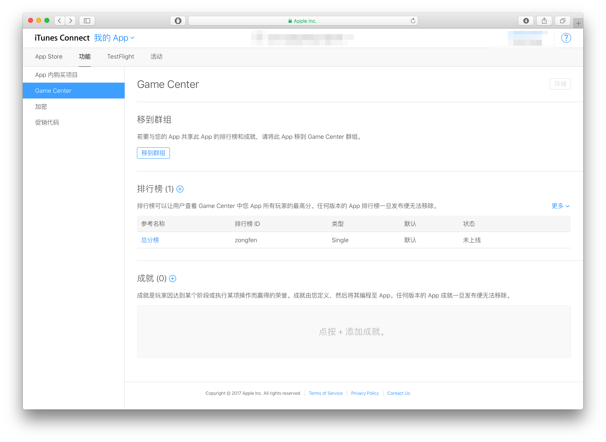
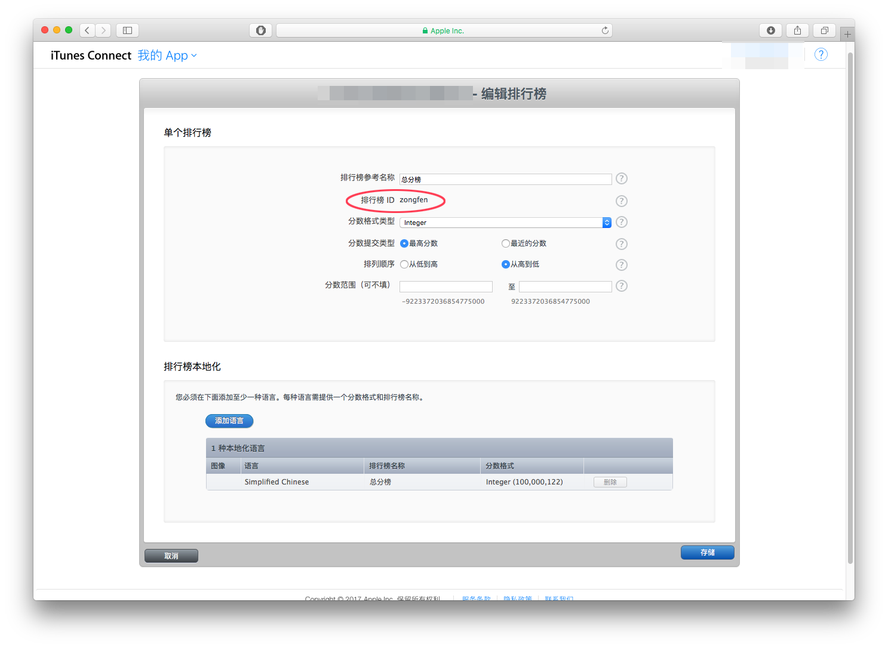

####unity里接入GameCenter
unity的API里集成Game Center，所以直接在unity里调用就行了。
这里说一下后台的申请。  
>先申请好app，然后到iTunes connect对应App里。  
>功能->Game Center->排行榜 点击后面的加号。  
 
  
需要注意，这里的排行榜ID在游戏中提交分数时需要用到。  
  
弄好之后就可以在游戏中添加代码了。  
>1.初始化Game Center  
>`GameCenterManager.GetInstance ().Start ();`  
>2.提交分数  
>`GameCenterManager.GetInstance ().ReportScore ("zongfen",100);`  
>**到时候记得更改你对应的排行榜ID(zongfen)和分数(100)。**  
>3.展示排行榜  
>`GameCenterManager.GetInstance ().ShowLeaderboard ();`  

GameCenterManager类
[GameCenterManager.cs](./SDK/GameCenterManager.cs)