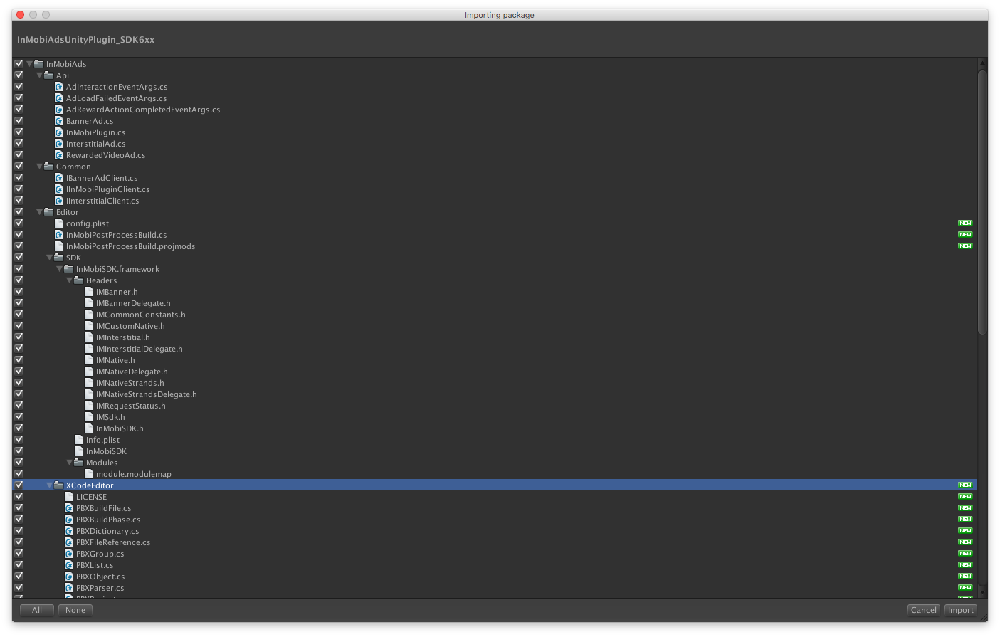

####今天需要接入imobi
InMobi于2007年在印度班加罗尔（Bangalore）成立，有提供banner，插屏，视频和原生广告的变现方式。
>我下的版本是  
>`InMobiAdsUnityPlugin_SDK6xx.unitypackage`  
>戳[这里](https://www.dropbox.com/s/d8mexrgd11t25j3/InMobiAdsUnityPlugin_SDK6xx.unitypackage?dl=0)下载  
>[官网接入指引](https://support.inmobi.com/monetize/partner-platforms-guidelines/unity/)  

先导包  
  
可以将android有关的取消勾选再导入，也可以全部导入。  
另外里面有**Editor**和**XCodeEditor**两个文件夹是用来快速打包的，会在build Xcode工程后为xcode工程添加依赖修改配置等。  

>1.如果没有选择自动导入，需要手动移动一下文件。  
>将Editor－>iOS文件夹下的.h文件全部放到Plugins->iOS文件夹下。

>初始化并且请求banner
>
>		InMobiPlugin inmobiPlugin = new InMobiPlugin (Myparameters.Imobi_ID);
		RequestBanner ();
		private void RequestBanner ()
	{
		// Create a 320x50 banner at the bottom of the screen.
		BannerAd ban = new BannerAd (Myparameters.Imobi_BannerId, 320, 50, (int)InMobiAdPosition.BottomCenter);
		// Register for ad events.
		ban.OnAdLoadSucceeded += HandleOnAdLoadSucceeded;
		ban.OnAdLoadFailed += HandleAdLoadFailed;
		ban.OnAdDisplayed += HandleAdDisplayed;
		ban.OnAdDismissed += HandleAdDismissed;
		ban.OnAdInteraction += HandleAdInteraction;
		ban.OnUserLeftApplication += HandleUserLeftApplication;
		// Load a banner ad.
		ban.LoadAd ();
	}
>最后接入显示广告没有填充  
>错误代码
>
>		Error : Error Domain=com.inmobi.ads.requeststatus Code=1 "Server returned a no-fill. Please try again." UserInfo={NSLocalizedDescription=Server returned a no-fill. Please try again.}